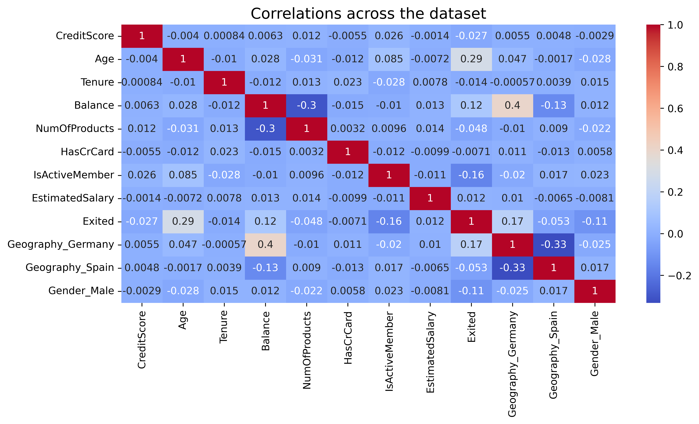
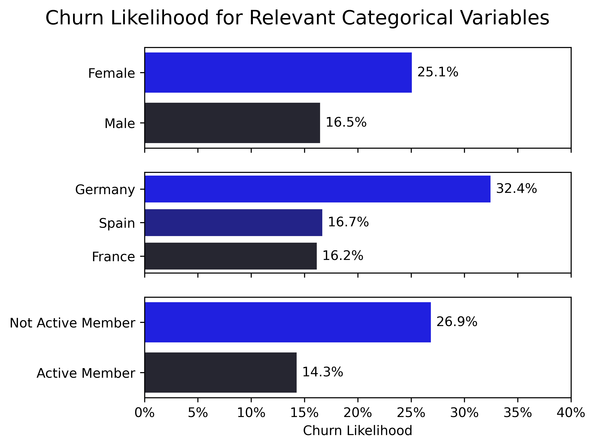
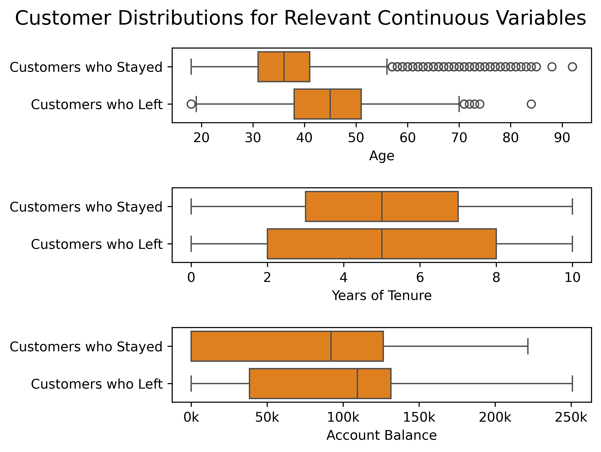
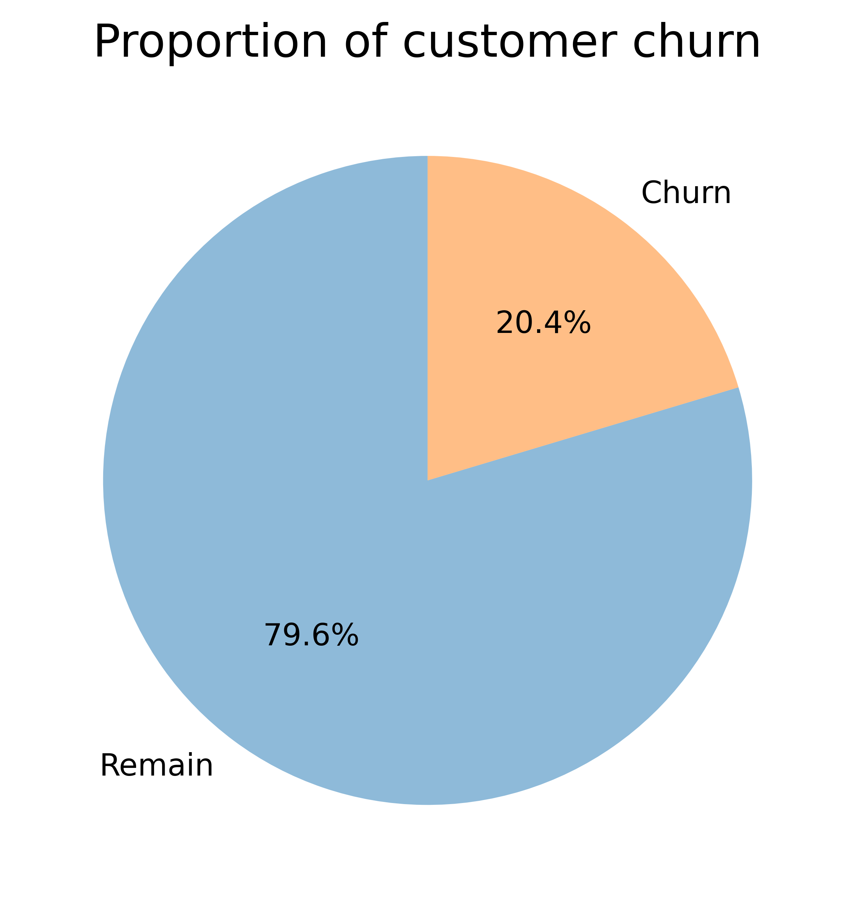
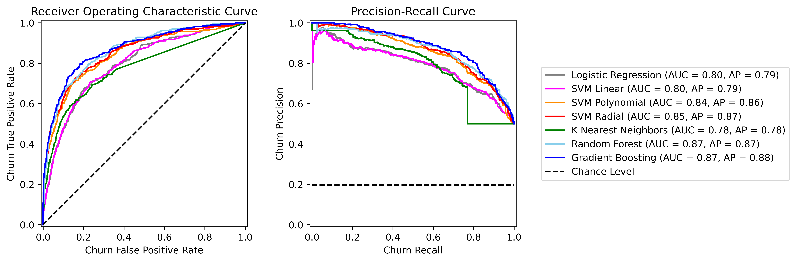
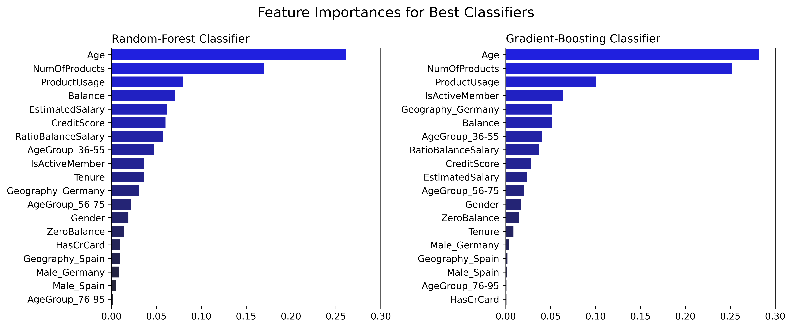

# Python project - Bank customer churn prediction

## Introduction
This project aims at predicting customer churn for a fictitious bank, based on the [Churn Modelling Kaggle dataset](https://www.kaggle.com/datasets/shrutimechlearn/churn-modelling?resource=download). It ultimately consists of a binary classification problem.

## Answered questions

1. What does customer churn correlate with? ([1_exploratory_data_analysis.ipynb](1_exploratory_data_analysis.ipynb))
2. What are the most important features to predict churn? ([2_churn_prediction.ipynb](2_churn_prediction.ipynb))

## Tools I used
This project was carried out using the following tools:
- **Python (Pandas, Matplotlib, Seaborn)** - backbone of the data analysis and visualization.
- **Python (Scikit-Learn)** - machine learning toolbox.
- **Jupyter Notebooks** - facilitating table and plot visualizations during the analysis.
- **Visual Studio Code** - my go-to code editor.
- **Git/Github** - essential for version control and code sharing.

## Exploratory data analysis

Exploratory data analysis was performed in the Jupyter Notebook [1_exploratory_data_analysis.ipynb](1_exploratory_data_analysis.ipynb).

### Correlation across the dataset

Correlation across the dataset features were computed and visualized within a heatmap.

```python
# Load data
df = pd.read_csv('Churn_Modelling.csv')

# Convert categorical variables into dummy variables
df_plot = pd.get_dummies(df)

# Compute correlations
correlations = df_plot.corr(numeric_only=True)
```



There are little correlations throughout the dataset. Nevertheless, let us take a look at a few variables that are somewhat correlated to the `Exited` column, which indicates if a customer has remained with bank or left it, namely:
- `Gender`.
- `Geography`.
- `IsActiveMember`.
- `Age`.
- `Balance`.

We will also take a look at `Tenure`, which indicates the number of years for which a customer has been with the bank. This will facilitate disentangling the age from the time spent as a customer at the bank (although we already see in the above figure that `Age` is more correlated to `Exited` than `Tenure`). 

### Churn likelihood for relevant categorical variables

The likelihood of customers leaving the bank was computed for gender, geography and active-membership groupings using the following function. For a given category, this churn likelihood was defined as the ratio of the number of customers that have left the bank to the total number of customers (in that category).

```python
def get_exit_proportion(df: pd.DataFrame,
                        column_name: str,
                        *,
                        sort_final: bool = True) -> pd.DataFrame:
    """
    Generate a table grouped by column_name with:
        - the total customer count ('total_count').
        - the count of customers that have exited ('exit_count').
        - the proportion of customers that have exited ('exit_proportion').

    If sort_final is True, the final dataframe is sorted by descending exit proportion.
    """

    # Compute total count
    df_count = df[column_name].value_counts().copy()
    df_count = df_count.reset_index(name='total_count')

    # Compute exit count
    df_exit = df[df['Exited'] == 1].groupby(column_name).size()
    df_exit = df_exit.reset_index(name='exit_count')

    # Merge tables
    df_final = pd.merge(df_count, df_exit, on=column_name, how='left')

    # Compute exit proportions
    df_final['exit_proportion'] = 100*df_final['exit_count']/df_final['total_count']

    # Sort according to exit proportion
    if sort_final:
        df_final = df_final.sort_values('exit_proportion', ascending=False)
        df_final = df_final.reset_index(drop=True)

    return df_final


df_gender = get_exit_likelihood(df, 'Gender')
df_geography = get_exit_likelihood(df, 'Geography')
df_member = get_exit_likelihood(df, 'IsActiveMember')
```



- There is a larger proportion of female customers than male customers that have left the bank.
- There are twice as many German customers that have left the bank as there are Spanish or French ones.
- Customers that have left the bank were less likely to be active members.

### Distributions of customers for relevant continuous variables

Distributions of the age, tenure and account balance of customers, grouped by churn status, were visualized.



- Customers who left the bank were typically older than customers who stayed.
- This age discrepancy does not seem to be related to the years of tenure, which are uncorrelated with leaving the bank.
    - This is also apparent in the correlation heatmap above.
- Customers who left the bank typically had larger balance in their accounts.

### Conclusion

Customer age, gender, account balance, geographical location may be relevant features for predicting churn.


## Churn prediction using machine learning

Data classification was performed in the Jupyter Notebook [2_churn_prediction.ipynb](2_churn_prediction.ipynb).

### Data imbalance

The total proportion of customers that have left the bank was visualized.



The dataset is imbalanced, with customer churn only representing a fifth of the data. This is to be expected for a functioning bank. This also means that this imbalance needed to be accounted for to ensure unbiased models. While we could do so using data over/under-sampling, we here enforced balanced class weights during model training. 

### Data preparation

Data was prepared for model training/testing according to the following pipeline.

```python
# Dummy copy
df_prep = df.copy()

# Drop irrelevant columns
df_prep = df_prep.drop(columns=['RowNumber', 'CustomerId', 'Surname'])

# Separate features and target
target_column = 'Exited'
feature_columns = df_prep.columns.to_list()
feature_columns.remove(target_column)

X = df_prep[feature_columns].copy()
y = df_prep[target_column].copy()

# Label encode gender from Female/Male to 0/1
label_encoder = LabelEncoder()
X['Gender'] = label_encoder.fit_transform(X['Gender'])

# One-hot encode geography
X = pd.get_dummies(X, columns=['Geography'], drop_first=True)
```

### Feature engineering

New features were created to potentially enhance the predictive power of our classifiers.

```python
# Binary feature for balance
X['ZeroBalance'] = (X['Balance'] == 0)

# Age groups
# (One of these groups, 36-55, covers the majority of customers leaving the bank,
#  as seen during the exploratory data analysis)
X['AgeGroup'] = pd.cut(X['Age'],
                       bins=[18, 35, 55, 75, 95],
                       labels=['18-35', '36-55', '56-75', '76-95'])
X = pd.get_dummies(X, columns=['AgeGroup'], drop_first=True)

# Ratio of balance and salary
X['RatioBalanceSalary'] = X['Balance']/X['EstimatedSalary']

# Number of products used by active members (0 if inactive member)
X['ProductUsage'] = X['NumOfProducts']*X['IsActiveMember']

# Combined gender/geography features
X['Male_Germany'] = X['Gender']*X['Geography_Germany']
X['Male_Spain'] = X['Gender']*X['Geography_Spain']
```

### Train/test split and feature scaling

After converting certain features to the boolean format, data was split into a training/testing set, and scaled using the standard strategy (avoiding boolean features in this scaling).

```python
# Convert relevant columns to bool
bool_columns = ['Gender', 'HasCrCard', 'IsActiveMember', 'Male_Germany', 'Male_Spain']
for c in bool_columns:
    X[c] = X[c].astype(bool)

# Train/test split
X_train, X_test, y_train, y_test = train_test_split(X, y, test_size=0.2, random_state=42)

# Feature scaling (our features have very different scales)
# We do not scale boolean features
non_bool_features = X.select_dtypes(exclude=['bool']).columns

scaler = StandardScaler()
X_train[non_bool_features] = scaler.fit_transform(X_train[non_bool_features])
X_test[non_bool_features] = scaler.transform(X_test[non_bool_features])
```


### Model training, hyperparameter tuning and assessment

For churn prediction, one typically cares more about correctly predicting churn risks rather than correctly predicting all cases. Given customer churn is our positive class, we thus use the F1 score as a scoring metric when performing hyperparameter tuning _via_ cross-validated grid search. This tuning should strike a good balance between precision=TP/(TP+FP) and recall=TP/(TP+FN), maximizing true positives and minimizing false positives and false negatives. We will also make sure to train our models using class weights, to mitigate the effects of data imbalance. For bootstrap-based methods such as random forest, we will compute class weights at the bootstrap subsample level.

Various classifiers were tuned/trained _via_ cross-validated grid search and subsequently evaluated using similar code as below.

```python
# Cross-validated grid search
param_grid = {
    'n_estimators': [25, 50, 100],
    'max_depth': [5, 10, 20, None],
    'min_samples_split': [4, 6, 8],
    'max_features': ['sqrt', 'log2']
}

grid_search = GridSearchCV(
    estimator=RandomForestClassifier(class_weight='balanced_subsample',
                                     random_state=42),
    param_grid=param_grid,
    scoring='f1'
)
grid_search.fit(X_train, y_train)

# Best estimator
model_rf = grid_search.best_estimator_

# Evaluation
y_pred = model_rf.predict(X_test)
print(classification_report(y_test, y_pred))
```

These models include:
- logistic-regression classifier.
- linear support-vector-machine classifier.
- radial support-vector-machine classifier.
- k-nearest-neighbors classifier.
- random-forest classifier.
- gradient-boosting classifier.

We used the receiver operating characteristic (ROC) curve and the precision recall curve to compare model performance. While the former returns the area under the curve (AUC), the latter returns the average precision (AP). Sample weights were used to account for data imbalance.



- The logistic-regression, linear-kernel support-vector-machine and k-nearest-neighbor classifiers performed rather poorly compared to other models.
- The polynomial-kernel and radial-kernel support vector machines performed well, but were surpassed by the random-forest and gradient-boosting classifiers.

Even though the random-forest and gradient-boosting classifiers performed similarly, the previous classification reports (printed in [2_churn_prediction.ipynb](2_churn_prediction.ipynb)) showed that they yielded different levels of precision and recall (for similar F1 scores) when predicting churn:
- Random forest model: precision=0.58 and recall=0.69 for predicting churn.
- Gradient-boosting model: precision=0.75 and recall=0.50 for predicting churn.

When predicting churn, one typically cares more about avoiding false negatives (which may prove costly to the bank) rather than false positives, thereby favoring maximizing recall=TP/(TP+FN) over precision=TP/(TP+FP). In that sense, the random-forest classifier performs better than the gradient-boosting model.

## Feature importance

We visualized feature importances for our two best classifiers.



- The three most important features to predict churn (also common to both the random-forest and gradient-boosting classifiers) are:
    - the customer age `Age`.
    - the number of products used by the customer `NumOfProducts`.
    - the newly engineered effective product usage `ProductUsage`, _i.e._, the number of products used by active bank members (inactive bank members are considered to have zero product usage).
- The following features are rather unimportant for both classifiers: `HasCrCard`, `Geography_Spain`, `Male_Spain`, `Male_Germany`, `AgeGroup_56-75`, `AgeGroup_76-95`, `ZeroBalance`, `Gender`.
- While the exploratory data analysis identified customer age, gender account balance and geographical location (mostly Germany) as promising features for predicting churn, gender is not very important for classification in the end.


## Feature selection

We removed the 8 aforementioned unimportant features to see how the random-forest and gradient-boosting classifiers performed. Both classifiers still performed similarly to above after going down from 19 to 11 features.