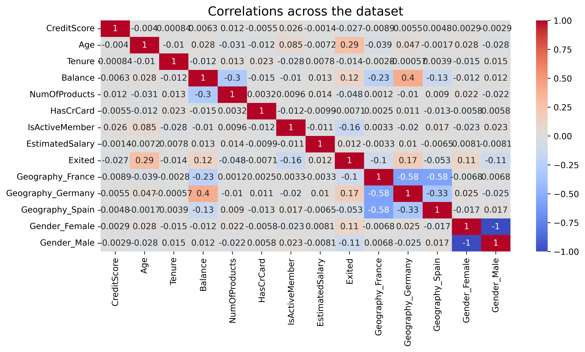
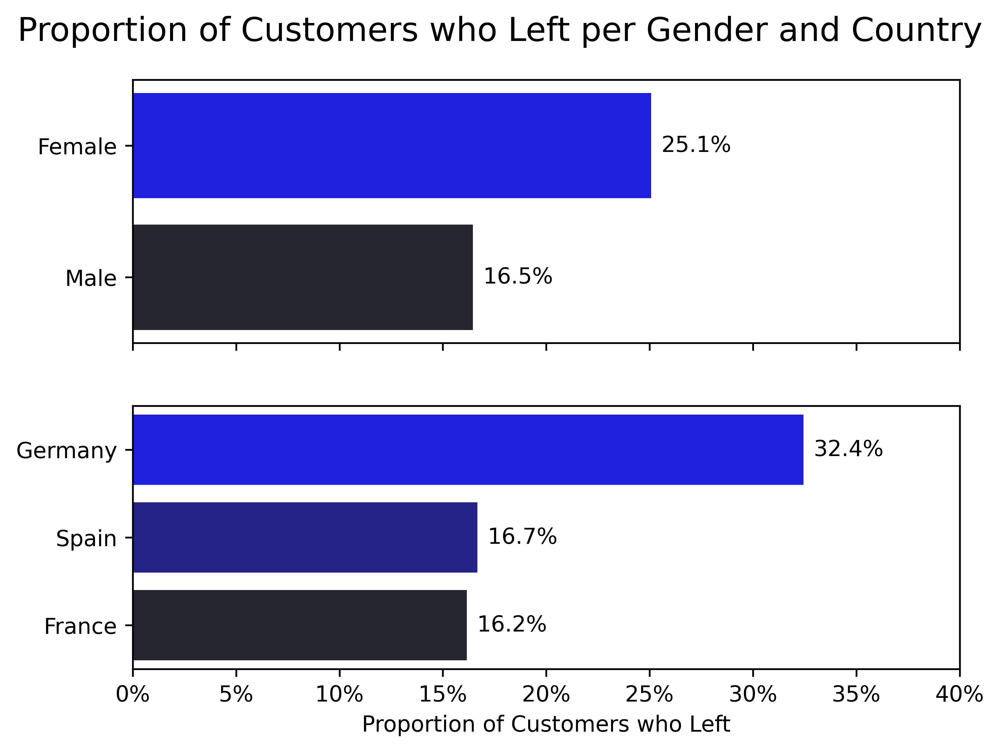
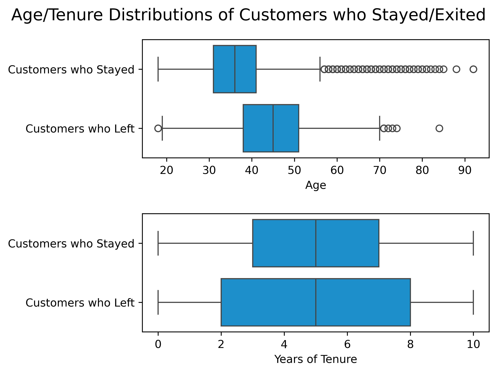
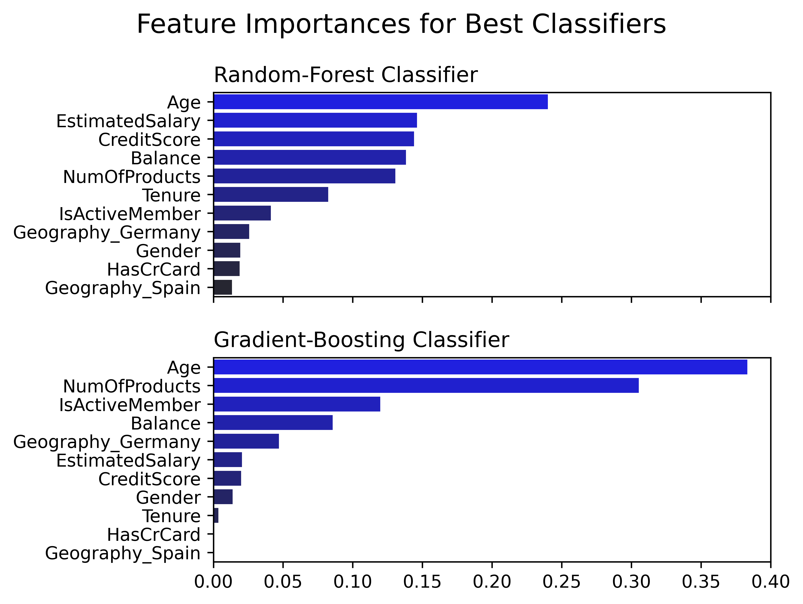
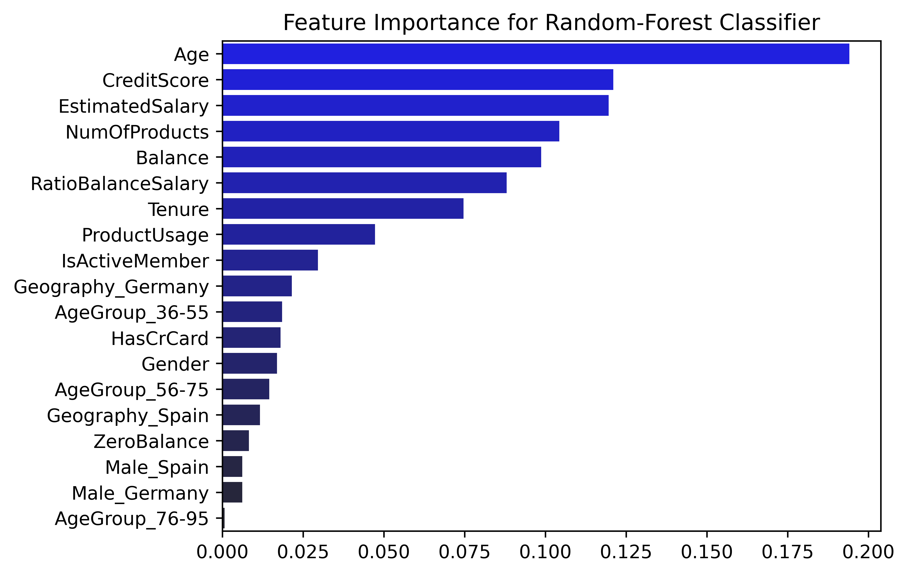
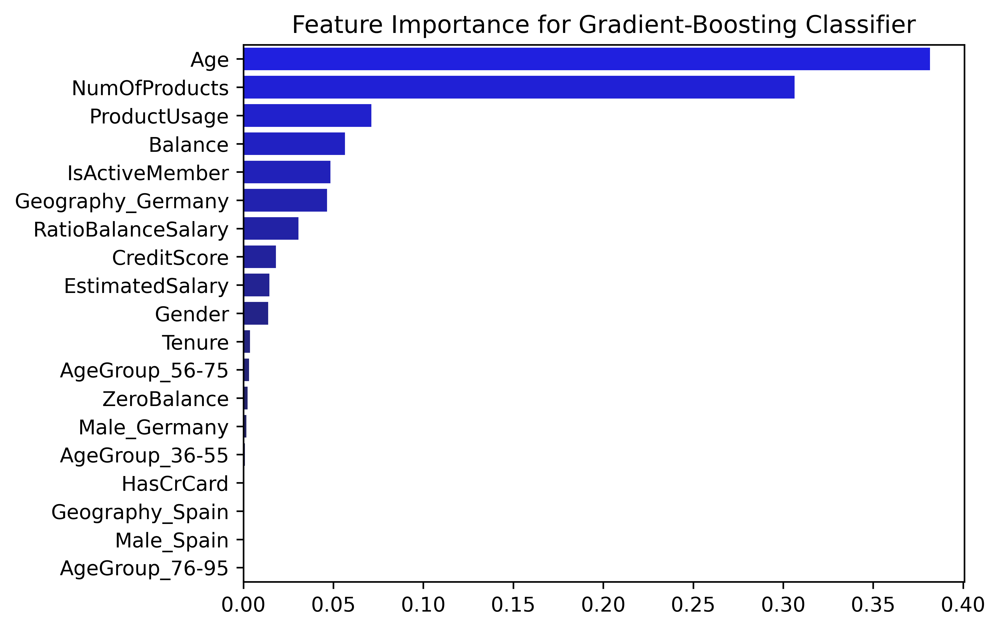
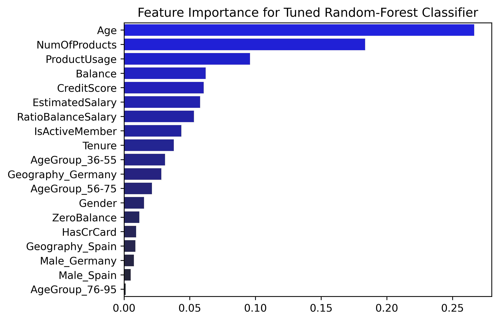

# Python project - Churn prediction

## Introduction
This project aims at predicting churn for a fictitious bank, based on the [Churn Modelling](https://www.kaggle.com/datasets/shrutimechlearn/churn-modelling?resource=download) Kaggle dataset. It ultimately consists of a binary classification problem.

## Answered questions

1. Does the churn correlate with gender, geographical location, age? ([1_exploratory_data_analysis.ipynb](1_exploratory_data_analysis.ipynb))
2. What are the most important features to predict churn? ([2_churn_prediction.ipynb](2_churn_prediction.ipynb))

## Tools I used
This project was carried out using the following tools:
- **Python (Pandas, Matplotlib, Seaborn)** - backbone of the data analysis and visualization.
- **Python (Scikit-Learn)** - machine learning toolbox.
- **Jupyter Notebooks** - facilitating table and plot visualizations during the analysis.
- **Visual Studio Code** - my go-to code editor.
- **Git/Github** - essential for version control and code sharing.

## Exploratory data analysis

Exploratory data analysis was performed in the Jupyter Notebook [1_exploratory_data_analysis.ipynb](1_exploratory_data_analysis.ipynb).

### Correlation across the dataset

Correlation across the dataset features were computed and visualized within a heatmap.

```python
# Load data
df = pd.read_csv('Churn_Modelling.csv')

# Convert categorical variables into dummy variables
df_plot = pd.get_dummies(df)

# Compute correlations
correlations = df_plot.corr(numeric_only=True)
```



There are little correlations throughout the dataset. Nevertheless, we took a look at a few variables that may be relevant to the `Exited` column, which indicates if a customer has stayed/left with the bank, namely:
- `Gender`.
- `Geography`.
- `Age`.

We also took a look at `Tenure`, which indicates the number of years for which a customer has been with the bank. This may facilitate disentangling the age from the time spent as a customer at the bank (although we already see in the above figure that `Age` is more correlated to `Exited` than `Tenure`). 

### Churn distributions

#### Gender and geography

The proportion of customers who left the bank was computed for gender and country groupings using the following function:

```python
def get_exit_proportion(df: pd.DataFrame,
                        column_name: str,
                        *,
                        sort_final: bool = True) -> pd.DataFrame:
    """
    Generate a table grouped by column_name with:
        - the total customer count ('total_count').
        - the count of customers that have exited ('exit_count').
        - the proportion of customers that have exited ('exit_proportion').

    If sort_final is True, the final dataframe is sorted by descending exit proportion.
    """

    # Compute total count
    df_count = df[column_name].value_counts().copy()
    df_count = df_count.reset_index(name='total_count')

    # Compute exit count
    df_exit = df[df['Exited'] == 1].groupby(column_name).size()
    df_exit = df_exit.reset_index(name='exit_count')

    # Merge tables
    df_final = pd.merge(df_count, df_exit, on=column_name, how='left')

    # Compute exit proportions
    df_final['exit_proportion'] = 100*df_final['exit_count']/df_final['total_count']

    # Sort according to exit proportion
    if sort_final:
        df_final = df_final.sort_values('exit_proportion', ascending=False)
        df_final = df_final.reset_index(drop=True)

    return df_final
```



- There is a larger proportion of female customers than male customers that have left the bank.
- There are twice as many German customers that have left the bank as there are Spanish or French ones. 

#### Age and tenure

Distributions of the age and tenure of customers, grouped by churn status, were directly visualized from the initial dataset.



- Customers who left the bank were typically older than customers who stayed.
- This age discrepancy does not seem to be related to the years of tenure, which are uncorrelated with leaving the bank.
    - This is also apparent in the correlation heatmap above.

### Conclusion

Customer age, gender and geographical location may be relevant features for predicting churn.


## Churn prediction using machine learning

Data classification was performed in the Jupyter Notebook [2_churn_prediction.ipynb](2_churn_prediction.ipynb).

**NB:** The dataset is imbalanced, with roughly 4 times as many customers that have stayed at the bank as customers that have left it. This is to be expected for a functioning bank. In this project, we do not perform any data over/under-sampling to try to mitigate the effects of data imbalance. As a result, we can expect ensemble techniques (_e.g._, random forest) to perform better on this data.

### Data preparation

Data was prepared for model training/testing according to the following pipeline.

```python
# Dummy copy
df_prep = df.copy()

# Label encode gender from Female/Male to 0/1
label_encoder = LabelEncoder()
df_prep['Gender'] = label_encoder.fit_transform(df_prep['Gender'])

# One-hot encode geography
df_prep = pd.get_dummies(df_prep, columns=['Geography'], drop_first=True)

# Select features for analysis
features = ['CreditScore', 'Gender', 'Age', 'Tenure', 'Balance',
            'NumOfProducts', 'HasCrCard', 'IsActiveMember',
            'EstimatedSalary', 'Geography_Germany', 'Geography_Spain']

# Split data into training and testing sets
X = df_prep[features]
y = df_prep['Exited']

X_train, X_test, y_train, y_test = train_test_split(X, y, test_size=0.2, random_state=42)

# Feature scaling (our features have very different scales)
scaler = StandardScaler()
X_train = scaler.fit_transform(X_train)
X_test = scaler.transform(X_test)
```

### Model training and assessment

Various classifiers were trained using similar code as below.

```python
# Build and train model
model_rand_forest = RandomForestClassifier(n_estimators=100, random_state=42)
model_rand_forest.fit(X_train, y_train)

# Make predictions
y_pred_rand_forest = model_rand_forest.predict(X_test)

# Evaluate model performance
conf_matrix_rand_forest = confusion_matrix(y_test, y_pred_rand_forest)
class_report_rand_forest = classification_report(y_test, y_pred_rand_forest)
accuracy_rand_forest = accuracy_score(y_test, y_pred_rand_forest)
```

These models include:
- random-forest classifier.
- logistic-regression classifier.
- linear support-vector-machine classifier.
- radial support-vector-machine classifier.
- k-nearest-neighbors classifier.
- gradient-boosting classifier.

The overall best classifiers (based on accuracy, precision and recall) were the random-forest and gradient-boosting models, as could be expected given the data imbalance. Feature importances were quantified for these two models using code similar to below.

```python
# Feature importance
importances = model_rand_forest.feature_importances_
indices = np.argsort(importances)[::-1]
names = [features[i] for i in indices]
```



- Feature importances differ between our two best classifiers.
- That being said, customer age is the most important feature for both classifiers.
    - Customer age was already identified as an important feature when assessing churn likelihood during the exploratory data analysis.
- Compared to the random-forest classifier, the gradient-boosting classifier gives more importance to its few top features.


### Feature engineering

New features were engineered to potentially enhance the generalizability of our classifiers.

```python
df_eng = df_prep.copy()

# Binary feature for balance
df_eng['ZeroBalance'] = (df_eng['Balance'] == 0)

# Age groups
# (One of these groups, 36-55, covers the majority of customers leaving the bank,
#  as seen during the exploratory data analysis)
df_eng['AgeGroup'] = pd.cut(df_eng['Age'],
                            bins=[18, 35, 55, 75, 95],
                            labels=['18-35', '36-55', '56-75', '76-95'])

df_eng = pd.get_dummies(df_eng, columns=['AgeGroup'], drop_first=True)

# Ratio of balance and salary
df_eng['RatioBalanceSalary'] = df_eng['Balance']/df_eng['EstimatedSalary']

# Number of products in active use
df_eng['ProductUsage'] = df_eng['NumOfProducts']*df_eng['IsActiveMember']

# Combined gender/geography features
df_eng['Male_Germany'] = df_eng['Gender']*df_eng['Geography_Germany']
df_eng['Male_Spain'] = df_eng['Gender']*df_eng['Geography_Spain']
```

Data was then prepared and used to train/test new random-forest and gradient-boosting classifiers.

```python
# Select features for analysis
features = (['CreditScore', 'Gender', 'Age', 'Tenure', 'Balance',
             'NumOfProducts', 'HasCrCard', 'IsActiveMember',
             'EstimatedSalary', 'Geography_Germany', 'Geography_Spain']
            + ['ZeroBalance', 'RatioBalanceSalary', 'ProductUsage',
               'Male_Germany', 'Male_Spain']
            + [column for column in df_eng.columns if ('AgeGroup_' in column)]
            )

# Split data into training and testing sets
X = df_eng[features]
y = df_eng['Exited']

X_train, X_test, y_train, y_test = train_test_split(X, y, test_size=0.2, random_state=42)

# Feature scaling (our features have very different scales)
scaler = StandardScaler()
X_train = scaler.fit_transform(X_train)
X_test = scaler.transform(X_test)
```

With the new features:
- The performance of the random-forest classifier improved very slightly.
- However, the performance of the gradient-boosting classifier worsened very slightly.

The feature importance for these new classifiers are visualized below.





The aforementioned performance changes observed after feature engineering may be due to the fact that the random-forest classifier employs most of the features (including the new ones) to a certain extent, while the gradient-boosting classifier still focuses on its few top features.


### Hyperparameter tuning

The hyperparameters of a random-forest classifier were tuned using cross-validated grid search.

```python
# Cross-validated grid search
param_grid = {
    'n_estimators': [25, 50, 100],
    'max_depth': [5, 10, 20, None],
    'min_samples_split': [2, 4, 6],
    'max_features': ['sqrt', 'log2']
}

grid_search = GridSearchCV(estimator=RandomForestClassifier(random_state=42),
                           param_grid=param_grid,
                           scoring='accuracy')
grid_search.fit(X_train, y_train)

model_rand_forest_tuned = grid_search.best_estimator_
```

The resulting tuned random-forest classifier still performed similarly to the aforementioned models, with the following feature importances.



- The top 4 features for the tuned random-forest classifier are now identical to those found previously for the gradient-boosting classifier.
- Like the previous gradient-boosting classifier, the tuned random-forest classifier also gives more importance to its top features. 

### Conclusion

The three most important features to predict churn appear to be:
- the customer age `Age`.
- the number of products used by the customer `NumOfProducts`.
- the newly engineered effective product usage `ProductUsage` (_i.e._, the product of the number of products and the current active bank membership).