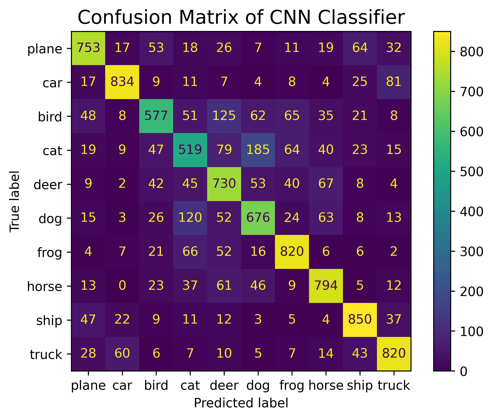
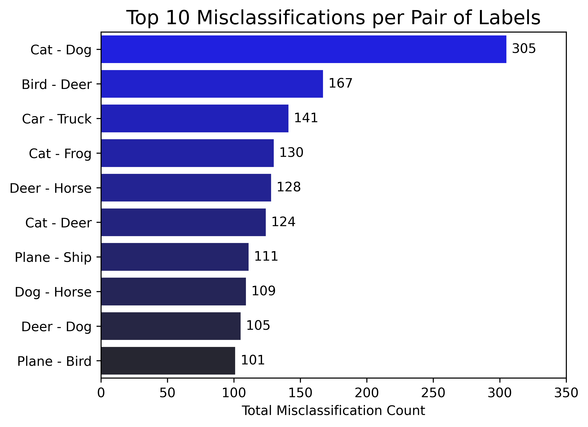

# Python project - CIFAR10 image classification

## Introduction
This project aims at classifying images into 10 classes using convolutional neural network.

## Tools I used
This project was carried out using the following tools:
- **Python (Numpy, Matplotlib, Seaborn)** - backbone of the data analysis and visualization.
- **Python (Pytorch)** - machine learning toolbox.
- **Jupyter Notebooks** - facilitating table and plot visualizations during the analysis.
- **Visual Studio Code** - my go-to code editor.
- **Git/Github** - essential for version control and code sharing.

## Project

The project was carried out in the Jupyter Notebook [image_classification.ipynb](image_classification.ipynb).

### Data loading and visualization

The CIFAR10 dataset contains 60000 32x32 color images distributed among 10 classes, with 6000 images per class (so the dataset is balanced).

```python
# Dataset has PILImage images of range [0, 1]
# We transform them to tensors of normalized range [-1, 1]
transform = transforms.Compose(
    [transforms.ToTensor(),
     transforms.Normalize((0.5, 0.5, 0.5), (0.5, 0.5, 0.5))]
)

# CIFAR10 data
input_size = 3  # Color channels in the images
pixel_size = 32  # Images are 32x32 pixels
train_dataset = torchvision.datasets.CIFAR10(root=data_directory,
                                             train=True,
                                             transform=transform,
                                             download=True)

test_dataset = torchvision.datasets.CIFAR10(root=data_directory,
                                            train=False,
                                            transform=transform,
                                            download=True)

# Data loader
batch_size = pixel_size
train_loader = DataLoader(dataset=train_dataset,
                          batch_size=batch_size,
                          shuffle=True)

test_loader = DataLoader(dataset=test_dataset,
                         batch_size=batch_size,
                         shuffle=False)
```


_Some images from the dataset._


### Convolutional neural network (CNN) classifier

The CNN classifier was defined as follows and was trained using a cross-entropy loss (typical for multi-class classifications) 

```python
class ConvolutionalNeuralNetwork(nn.Module):
    """
    Convolutional neural network.
    """
    def __init__(self,
                 input_size: int,
                 pixel_size: int,
                 num_classes: int,
                 drop_prob: float = 0.1,
                 block_size: int = 5,
                 block_scheduler_n: int = 20000) -> None:
        super().__init__()

        # Hyperparameters
        conv_kernel_size = 3
        pool_size = 2
        hidden_size_1 = 32
        hidden_size_2 = 64
        hidden_size_3 = 128
        hidden_size_fc = 64

        # Activation function
        self.activation = nn.ReLU()

        # Convolutional layers
        self.conv_1 = nn.Conv2d(input_size, hidden_size_1, conv_kernel_size)
        self.conv_2 = nn.Conv2d(hidden_size_1, hidden_size_2, conv_kernel_size)
        self.conv_3 = nn.Conv2d(hidden_size_2, hidden_size_3, conv_kernel_size)

        # Pooling layer
        self.pool = nn.MaxPool2d(pool_size, pool_size)

        # We keep track of output_size, i.e., what pixel_size becomes 
        # throughout the network layers, to know which input size value 
        # input_size_linear to set for the first fully connected layer self.fc1 below
        output_size = pixel_size - (conv_kernel_size - 1)  # After conv_1
        output_size = np.floor((output_size - pool_size)/pool_size + 1).astype(int)  # After pooling
        output_size -= (conv_kernel_size - 1)  # After conv_2
        output_size = np.floor((output_size - pool_size)/pool_size + 1).astype(int)  # After pooling
        output_size -= (conv_kernel_size - 1)  # After conv_3

        if output_size <= 0:
            raise ValueError('output_size <= 0, check other dimensions to get output_size > 0')
        
        # We flatten the output of the convolutional layers
        input_size_flatten = hidden_size_3*output_size*output_size

        # Fully connected layers for classification
        self.fc_1 = nn.Linear(input_size_flatten, hidden_size_fc)
        self.fc_2 = nn.Linear(hidden_size_fc, num_classes)


    def forward(self, x: torch.Tensor) -> torch.Tensor:
        # x has size (N=batch_size, 3, 32, 32)
        # (Output sizes indicated below assuming conv_kernel_size = 3,
        #  pool_size = 2, hidden_size_1 = 32, hidden_size_2 = 64)
        x = self.activation(self.conv_1(x))  # (N, 32, 30, 30)
        x = self.pool(x)                     # (N, 32, 15, 15)
        x = self.activation(self.conv_2(x))  # (N, 64, 13, 13)
        x = self.pool(x)                     # (N, 64, 6, 6)
        x = self.activation(self.conv_3(x))  # (N, 64, 4, 4)
        x = torch.flatten(x, 1)              # (N, 1024)
        x = self.activation(self.fc_1(x))    # (N, 64)
        x = self.fc_2(x)                     # (N, num_classes)
        return x
```

The evaluation of the model on the testing dataset yielded an accuracy of 73.7%, associated with the confusion matrix below.



The missclassification count below shows that the cat and dog labels are the most likely labels to be misclassified as each other.


