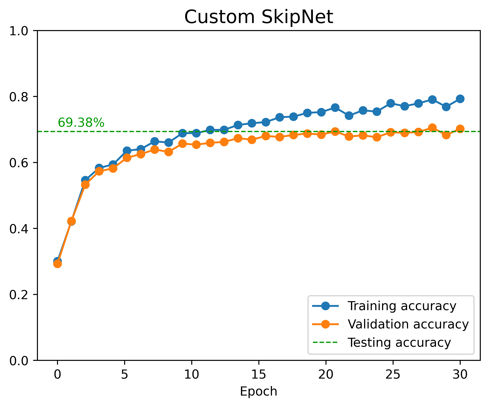

# Python project - CIFAR-10 image classification using a residual neural network (ResNet)

## Introduction
This project aims at classifying 32x32 color images into 10 classes using a convolutional neural network. We compare the performance of a residual network (ResNet) with a traditional convolutional network and a similar network wherein residual connections were replaced by skip connections. 

## Tools I used
This project was carried out using the following tools:
- **Python (Numpy, Matplotlib, Seaborn)** - backbone of the data analysis and visualization.
- **Python (Pytorch)** - machine learning toolbox.
- **Jupyter Notebooks** - facilitating table and plot visualizations during the analysis.
- **Visual Studio Code** - my go-to code editor.
- **Git/Github** - essential for version control and code sharing.

## Project

The project was carried out in the Jupyter Notebook [image_classification.ipynb](image_classification.ipynb).

### Data loading and visualization

The CIFAR10 dataset contains 60000 32x32 color images distributed among 10 classes, with 6000 images per class (so the dataset is balanced). Data was loaded and subsequently split into training, validation and testing sets.

```python
pixel_size = 32  # Images are 32x32 pixels

# Composition of transforms for our dataset (PIL images)
# The last normalization step rescales using the mean and std of the data
data_mean = [0.485, 0.456, 0.406]
data_std = [0.229, 0.224, 0.225]
transform = transforms.Compose(
    [transforms.Resize(pixel_size),  # Bilinear interpolation
     transforms.ToTensor(),  # Conversion to tensor (float conversion and 0-1 rescaling)
     transforms.Normalize(data_mean, data_std)]

# Loading MNIST dataset of handwritten digits
train_data = datasets.CIFAR10(data_dir,
                              train=True,
                              download=True,
                              transform=transform)
test_data = datasets.CIFAR10(data_dir,
                             train=False,
                             download=True,
                             transform=transform)

# Let us split the training set into train and validation sets
train_size = 0.9
n_samples_train = int(len(train_data)*train_size)
n_samples_val = len(train_data) - n_samples_train
train_data, val_data \
    = torch.utils.data.random_split(train_data,
                                    [n_samples_train, n_samples_val],
                                    generator=torch.Generator().manual_seed(42))
```


_Some images from the dataset._


### Convolutional neural network (CNN) classifiers

Three CNN classifiers were designed as follows:
- an initial set of convolutional/pooling layers downsamples feature maps to get a reasonable number of parameters.
- a block of layers comes after and can be set as a traditional convolutional block `ConvBlock`, a residual block `ResBlock` (with residual connections) or a skip block `SkipBlock` (with skip connections).
- after flattening the output and enforcing dropout, two fully connected layers handle the final classification. 

```python
class ConvBlock(nn.Module):
    # Convolutional block with no residual connection
    def __init__(self, n_channels: int) -> None:
        super().__init__()

        # Activation function
        self.activation = nn.ReLU()

        # Convolutional and batch-norm layers
        conv_kernel_size = 3
        conv_stride = 1
        conv_padding = 1
        self.conv1 = nn.Conv2d(in_channels=n_channels,
                               out_channels=n_channels//2,
                               kernel_size=conv_kernel_size,
                               stride=conv_stride,
                               padding=conv_padding)
        self.bn1 = nn.BatchNorm2d(n_channels//2)    # Normalize batch per channel
                                                    # to mitigate internal covariate shift
        self.conv2 = nn.Conv2d(in_channels=n_channels//2,
                               out_channels=n_channels,
                               kernel_size=conv_kernel_size,
                               stride=conv_stride,
                               padding=conv_padding)
    
    def forward(self, x: torch.Tensor) -> torch.Tensor:
        x = self.activation(x)  # Activate first to later compare with ResBlock below
        x = self.activation(self.bn1(self.conv1(x)))
        x = self.conv2(x)
        return x


class ResBlock(nn.Module):
    # Convolutional block with simple identity residual connection
    def __init__(self, n_channels: int) -> None:
        super().__init__()

        # Activation function
        self.activation = nn.ReLU()

        # Convolutional and batch-norm layers
        conv_kernel_size = 3
        conv_stride = 1
        conv_padding = 1
        self.conv1 = nn.Conv2d(in_channels=n_channels,
                               out_channels=n_channels//2,
                               kernel_size=conv_kernel_size,
                               stride=conv_stride,
                               padding=conv_padding)
        self.bn1 = nn.BatchNorm2d(n_channels//2)    # Normalize batch per channel
                                                    # to mitigate internal covariate shift
        self.conv2 = nn.Conv2d(in_channels=n_channels//2,
                               out_channels=n_channels,
                               kernel_size=conv_kernel_size,
                               stride=conv_stride,
                               padding=conv_padding)

    def forward(self, x: torch.Tensor) -> torch.Tensor:
        x0 = x  # Skip before activation
        x = self.activation(x)
        x = self.activation(self.bn1(self.conv1(x)))
        x = self.conv2(x)
        return x + x0  # Output addition


class SkipBlock(nn.Module):
    # Convolutional block with simple skip connection
    # Keep the output size equal to the input size if n_channels is even
    def __init__(self, n_channels: int) -> None:
        super().__init__()

        if n_channels % 2:  # Odd n_channels
            raise ValueError('n_channels should be even here, '
                             + 'to guarantee equal input and output sizes')

        # Activation function
        self.activation = nn.ReLU()

        # Convolutional and batch-norm layers
        conv_kernel_size = 3
        conv_stride = 1
        conv_padding = 1
        self.conv1 = nn.Conv2d(in_channels=n_channels,
                               out_channels=n_channels//2,
                               kernel_size=conv_kernel_size,
                               stride=conv_stride,
                               padding=conv_padding)
        self.bn1 = nn.BatchNorm2d(n_channels//2)
        self.conv2 = nn.Conv2d(in_channels=n_channels//2,
                               out_channels=n_channels//2,
                               kernel_size=conv_kernel_size,
                               stride=conv_stride,
                               padding=conv_padding)
    

    def forward(self, x: torch.Tensor) -> torch.Tensor:
        x1 = self.activation(self.conv1(x))

        x2 = self.activation(self.bn1(x1))
        x3 = self.conv2(x2)
        return torch.cat((x1, x3), 1)  # Output concatenation


def output_size_from_conv_pool(n_in: Tuple[int, int], conv_pool):
    kernel_size = conv_pool.kernel_size
    stride = conv_pool.stride
    dilation = conv_pool.dilation
    padding = conv_pool.padding

    if isinstance(kernel_size, tuple):
        n_out_0 = int(np.floor(
            (n_in[0] + 2*padding[0] - dilation[0]*(kernel_size[0] - 1) - 1)/stride[0] + 1))
        n_out_1 = int(np.floor(
            (n_in[1] + 2*padding[1] - dilation[1]*(kernel_size[1] - 1) - 1)/stride[1] + 1))
    else:
        n_out_0 = int(np.floor(
            (n_in[0] + 2*padding - dilation*(kernel_size - 1) - 1)/stride + 1))
        n_out_1 = n_out_0

    return (n_out_0, n_out_1)


class DeepNet(nn.Module):
    def __init__(self,
                 n_channels: int,
                 pixel_size: int,
                 n_hidden: int,
                 n_hidden_fc: int,
                 n_classes: int,
                 n_blocks: int = 2,
                 block_type = ResBlock,  # ConvBlock, ResBlock or SkipBlock
                 dropout: float = 0.5
                 ) -> None:
        super().__init__()

        # General architectural information
        self.activation = nn.ReLU()

        self.n_hidden = n_hidden

        conv_kernel_size = 3
        conv_stride = 1
        conv_padding = 1
        pool_kernel_size = 2

        # Max pooling layer
        self.pool = nn.MaxPool2d(pool_kernel_size)

        # Convolutional layers
        self.conv1 = nn.Conv2d(in_channels=n_channels,
                               out_channels=n_hidden,
                               kernel_size=conv_kernel_size,
                               stride=conv_stride,
                               padding=conv_padding)
        self.bn1 = nn.BatchNorm2d(n_hidden)

        self.conv2 = nn.Conv2d(in_channels=n_hidden,
                               out_channels=n_hidden,
                               kernel_size=conv_kernel_size,
                               stride=conv_stride,
                               padding=conv_padding)
        self.bn2 = nn.BatchNorm2d(n_hidden)

        self.conv3 = nn.Conv2d(in_channels=n_hidden,
                               out_channels=n_hidden,
                               kernel_size=conv_kernel_size,
                               stride=conv_stride,
                               padding=conv_padding)
        
        # nn.Sequential list of ResBlocks if n_blocks > 0
        self.n_blocks = n_blocks
        self.block_type = block_type
        if n_blocks > 0:
            self.layers = self.assemble_blocks()
        else:
            self.layers = nn.Identity()

        # Dropout layer
        self.dropout = nn.Dropout(p=dropout)

        # What pixel_size becomes through the initial layers
        # To set the input size of the final fully connected layer
        output_size = (pixel_size, pixel_size)
        output_size = output_size_from_conv_pool(output_size, self.conv1)
        output_size = output_size_from_conv_pool(output_size, self.pool)
        output_size = output_size_from_conv_pool(output_size, self.conv2)
        output_size = output_size_from_conv_pool(output_size, self.pool)
        output_size = output_size_from_conv_pool(output_size, self.conv3)
        output_size = output_size_from_conv_pool(output_size, self.pool)
        output_size = output_size[0]
        
        if output_size <= 0:
            raise ValueError('output_size <= 0, check other dimensions to get output_size > 0')    
        
        n_outputs = n_hidden*output_size**2

        # Fully connected layers
        self.linear1 = nn.Linear(n_outputs, n_hidden_fc)
        self.linear2 = nn.Linear(n_hidden_fc, n_classes)

        # Initialize loggers
        self.train_loss_logger = []
        self.train_accuracy_logger = []
        self.val_accuracy_logger = []


    def assemble_blocks(self):
        # Put together residual or skip blocks into an nn.Sequential
        blocks = []
        for _ in range(self.n_blocks):
            blocks.append(self.block_type(self.n_hidden))
        return nn.Sequential(*blocks)


    def forward(self, x: torch.Tensor) -> torch.Tensor:
        # Initial convolutional/pooling layers to downsample feature maps
        # and get a reasonable number of parameters for final classification
        # (No activation on final output so that 
        #  the subsequent blocks are fed the raw output)
        x = self.activation(self.bn1(self.conv1(x)))
        x = self.pool(x)
        x = self.activation(self.bn2(self.conv2(x)))
        x = self.pool(x)
        x = self.conv3(x)

        # Pass through blocks
        x = self.activation(self.layers(x))
        x = self.pool(x)

        # Flatten
        x = torch.flatten(x, 1)

        # Dropout to mitigate overfitting
        x = self.dropout(x)

        # Fully connected layers
        x = self.activation(self.linear1(x))
        x = self.linear2(x)

        return x
```

We defined three models using similar code as below (the example below corresponds to the ResNet case). Without changing any other parameter:
- the model with `block_type=ConvBlock` was called `Custom_ConvNet`.
- the model with `block_type=ResBlock` was called `Custom_ResNet`.
- the model with `block_type=SkipBlock` was called `Custom_SkipNet`.

The `ModelTrainer` class was taken and adapted from [Luke Ditria's GitHub account](https://github.com/LukeDitria/pytorch_tutorials/blob/main/section05_transfer_learning/notebooks/Trainer.py).

```python
from Trainer import ModelTrainer

# Define model
model_name = 'Custom_ResNet'
model = DeepNet(n_channels=n_channels_in,
                pixel_size=pixel_size,
                n_hidden=32,
                n_hidden_fc=32,
                n_classes=n_classes,
                n_blocks=6,
                block_type=ResBlock,
                dropout=0.5).to(device)

# Set up model trainer
batch_size = 128
n_epochs = 30
learning_rate = 1e-4
start_from_checkpoint = False

model_trainer = ModelTrainer(model=model,
                             device=device,
                             loss_fun=nn.CrossEntropyLoss(),
                             batch_size=batch_size,
                             learning_rate=learning_rate,
                             save_dir=model_dir,
                             model_name=model_name,
                             start_from_checkpoint=start_from_checkpoint)

# Set up data
model_trainer.set_data(train_set=train_data,
                       val_set=val_data,
                       test_set=test_data)
```

The training and validation accuracies throughout training are displayed below for all three networks. The final testing accuracy is also shown, as a guide to the eye.




**Breakdown:**
- The `Custom_ConvNet` classifier has reached an accuracy of 65.18%.
- The `Custom_SkipNet` classifier has reached an accuracy of 69.38%.
    - Better than `Custom_ConvNet` despite its fewer parameters.
- The `Custom_ResNet` classifier has reached an accuracy of 71.48%.
    - This corresponds to 6.3% more accuracy than `Custom_ConvNet` and 2.1% more accuracy than `Custom_SkipNet`.
- All networks present some degree of overfitting, as their training accuracy overshoots their validation accuracy.
    - `Custom_ConvNet` has the most overfitting.
    - Overfitting is mitigated in `Custom_ResNet` and `Custom_SkipNet`, with `Custom_SkipNet` having the lowest overfitting, potentially due to its fewer parameters.

### Further investigation of the ResNet predictions

Here is the confusion matrix of `Custom_ResNet`.


The missclassification count below shows that the cat and dog labels are the most likely labels to be misclassified as each other. Note that these top misclassified labels are shared by the other trained networks within this project.


