# Python project - Data job market analysis

## Introduction
This project was sourced and adapted from [Luke Barousse's Python course](https://www.lukebarousse.com/python). It focuses on analyzing a large dataset of data-analytics job postings from 2023 to gain insight into this job market's landscape.

## Answered questions
From the [exploratory data analysis](1_exploratory_data_analysis.ipynb):

1. Which roles have the most job postings?
2. Which countries have the most job postings?
3. What is the median yearly salary for the top roles and countries?
4. What is the proportion of remote-work opportunities for selected roles?
5. What are the top Swedish employers for selected roles?

From the rest of the study:

6. What are the most demanded skills for selected data roles?
7. Were there trends in terms of job-posting count or most demanded skills throughout 2023? 
8. Which data roles and skills are associated with higher salaries?
9. What are the most optimal skills to learn (_i.e._, high-paying and in-demand)?

## Tools I used
This project was carried out using the following tools:
- **Python (Pandas, Matplotlib, Seaborn)** - backbone of the data analysis and visualization.
- **Jupyter Notebooks** - facilitating table and plot visualizations during the analysis.
- **Visual Studio Code** - my go-to code editor.
- **Git/Github** - essential for version control and code sharing.

## Data cleaning

The job-market dataset was downloaded from [Luke Barousse's Hugging Face data repository](https://huggingface.co/datasets/lukebarousse/data_jobs). Data cleaning was then carried out along the following steps:

1. Remove duplicates.
2. Convert the job-posting dates to the `datetime` format (to facilitate date manipulations).
3. Convert the job skills from a list of strings stored as a string to a list of strings.

```python
import ast
import pandas as pd
from datasets import load_dataset

# Load data
dataset = load_dataset('lukebarousse/data_jobs')
df = dataset['train'].to_pandas()

# Drop duplicates
df = df.drop_duplicates()

# Convert date to datetime
df['job_posted_date'] = pd.to_datetime(df['job_posted_date'])

# Convert df['job_skills'] from a string to a list of strings
convert_skills = lambda x: ast.literal_eval(x) if pd.notna(x) else x
df['job_skills'] = df['job_skills'].apply(convert_skills)
```

## Exploratory data analysis

Exploratory data analysis was performed in the Jupyter Notebook [1_exploratory_data_analysis.ipynb](/python_projects/data_job_market/1_exploratory_data_analysis.ipynb).

### General aspects

The figures below capture some general aspects of the dataset:

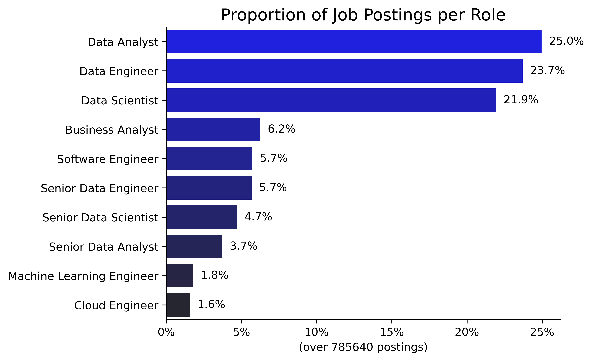

- The data-analyst, data-engineer and data-scientist roles account for almost 75% of all job postings.

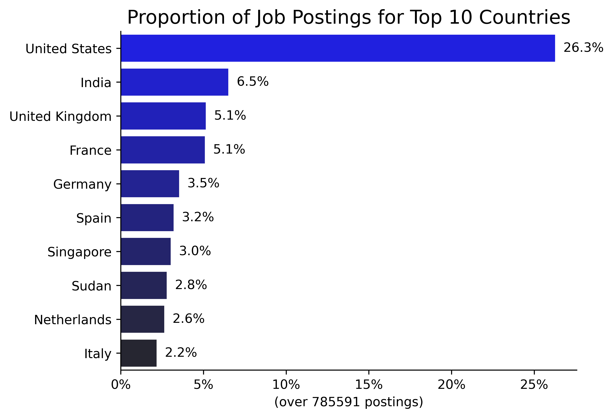

- Data jobs were mostly posted in the United States, which accounts for ~26% of all job postings.

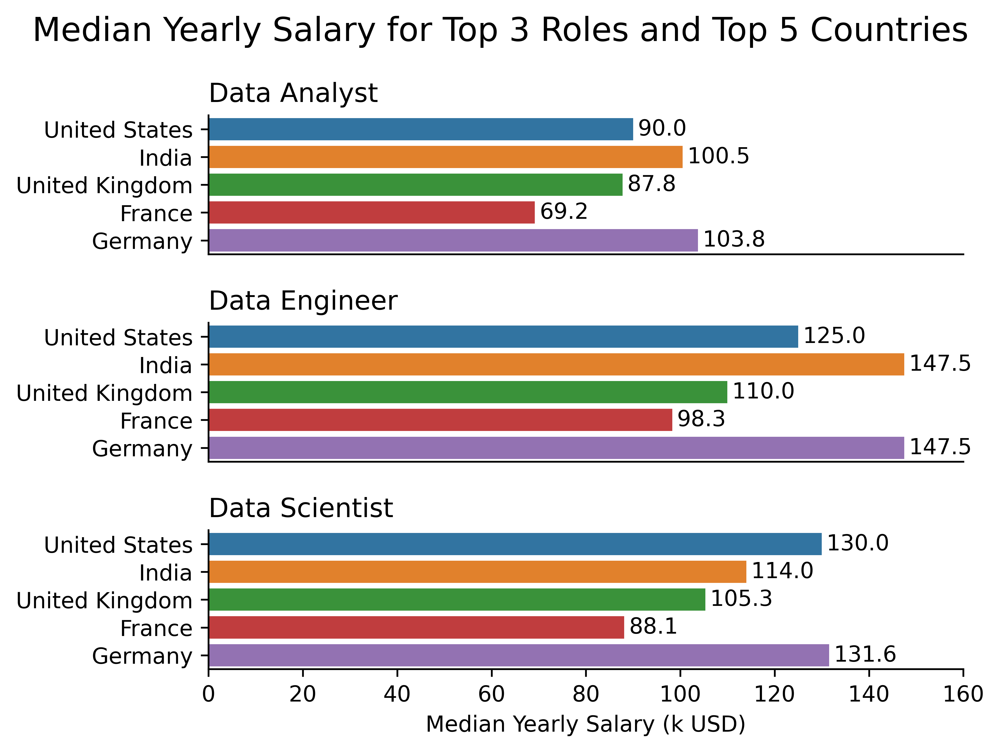

- There are salary discrepancies between roles and countries, with (i) data-analyst job postings typically offering less salary than data-scientist and data-engineer ones and (ii) Germany typically offering higher salaries and France lower ones.


### Personal interests

Living in Sweden, I was interested in looking at the main Swedish employers as well as remote-work opportunities.

#### Remote-work opportunities

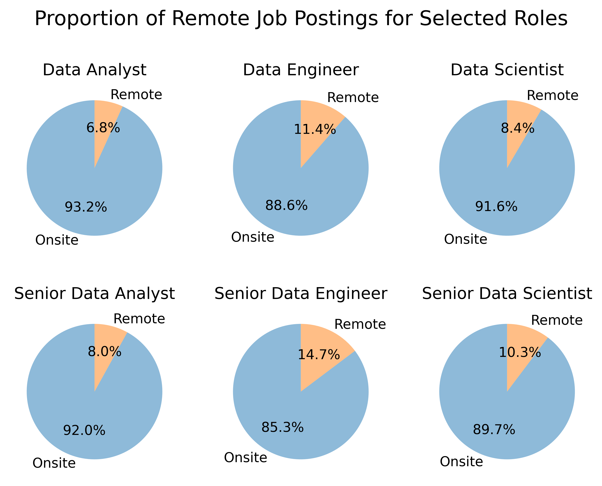

- Remote positions are a small fraction of all job postings, with a maximum of ~15% for senior-data-engineer job postings.
- Senior roles give more opportunities than standard roles for remote work, which may be due to the higher autonomy senior roles have. 
- Regardless of seniority level, data-analyst job postings have the smallest proportion of remote work and data-engineer job postings have the highest.

#### Main Swedish employers

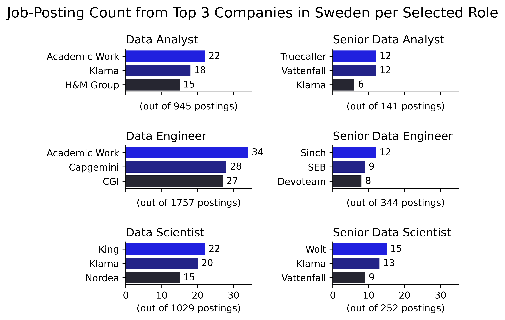

- The fintech company **Klarna** is the most shared main employer across selected roles, namely for (senior)-data-analyst and (senior)-data-scientist roles.
- The recruitment and staffing company **Academic Work** is the top employer for data-analyst and data-engineer roles.
- The energy company **Vattenfall** is one of the main employers for both senior-data-analyst and senior-data-scientist roles.


## What are the most demanded skills for selected data roles?

The Python code yielding the analysis/visualization below can be found in the Jupyter Notebook [2_skill_demand.ipynb](/python_data_job_analysis/2_skill_demand.ipynb).

Most demanded skills were identified by exploding the skill lists in `job_skills`, counting skills per job title, and sorting according to the skill count.  

```python
# Placeholder in case we want to pre-filter data before analysis
# (e.g., based on job_country for instance)
df_relevant = df.copy()

# Explode skills (which are initially contained in lists within 'job_skills')
df_skills = df_relevant.explode('job_skills')

# Group by job_skills and job_title_short and count the number of occurrences
df_skills = df_skills.groupby(['job_skills', 'job_title_short']).size()

# Rename the count column as skill_count
df_skills = df_skills.reset_index(name='skill_count')

# Sort the values by skill_count in descending order
df_skills = df_skills.sort_values('skill_count', ascending=False)
```

Given counts do not show the actual proportion of jobs that request the above skills, we also compute the likelihood for these skills to be requested. Here, we define the skill likelihood as the ratio between the skill count and the number of job postings associated with a given job title.

```python
# Compute the count of job titles
df_jobs = df_relevant['job_title_short'].value_counts()

# Rename count to job_count
df_jobs = df_jobs.reset_index(name='job_count')

# Merge df_skills and df_jobs
# (Ensures that, for a given a job title, each skill count 
#  is associated with the total number of job postings)
df_skills_job = pd.merge(df_skills, df_jobs, on='job_title_short', how='left')

# Compute likelihood
df_skills_job['skill_likelihood'] \
    = 100*(df_skills_job['skill_count']/df_skills_job['job_count'])
```

The most popular data roles (and their senior counterparts) were selected to get a better sense of how skillsets differ between roles and evolve with seniority.

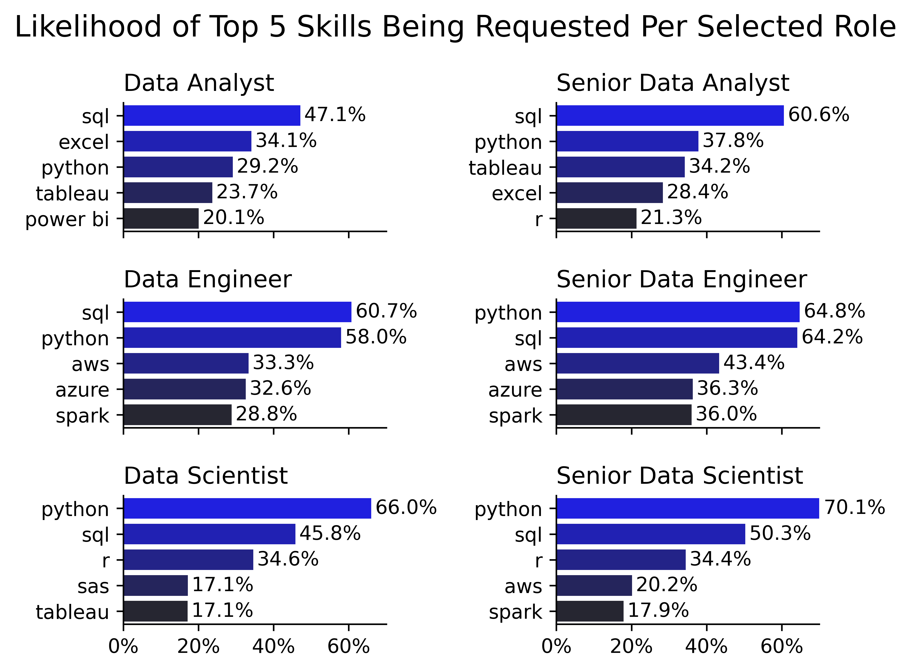

- As expected, technical expectations are higher for senior roles, with skill likelihoods being typically higher for these roles.
- There seems to be a lot of variety in the skillsets requested for data-analyst roles, as no skill is requested more often than not (_i.e._, likelihood above 50%).
- `python` is requested more often than not for:
    - senior-data-analyst roles.
    - (senior)-data-engineer roles.
    - (senior)-data-scientist roles.
- `sql` is requested more often than not for:
    - senior-data-analyst roles.
    - (senior)-data-engineer roles.
    - senior-data-scientist roles.
- (Senior)-data-analyst job postings mostly request:
    - fundamental data-handling/analysis (`sql`, `excel`, `python`).
    - data-visualization (`tableau`/`power bi`) tools.
- (Senior)-data-engineer job postings mostly request:
    - `sql` and `python`.
    - cloud-platform tools such as `aws`, `azure` and `spark`.
- (Senior)-data-scientist job postings mostly request:
    - `python`, `sql` and `r`.
    - cloud-platform tools (`aws`, `spark`) for senior roles.


## Were there trends in terms of job-posting count or most demanded skills throughout 2023?

The Python code yielding the analysis/visualization below can be found in the Jupyter Notebook [3_skill_monthly_trends.ipynb](/python_data_job_analysis/3_skill_monthly_trends.ipynb).

The dataset covers data job postings throughout 2023. It may be interesting to look at how the number of job postings and the likelihood for skills to be requested behaved monthly. Here, we focused on data-analyst job-postings as an example. Answering the question at hand was a great opportunity to use a pivot table, as shown below.

```python
# Pre-filter based on job_title_short
job_title = 'Data Analyst'
df_relevant = df[df['job_title_short'] == job_title].copy()

# Extract month from date
df_relevant['job_posted_month'] = df_relevant['job_posted_date'].dt.month

# Compute job count per month
df_job_month = df_relevant.groupby('job_posted_month').size()

# Explode skills (which are initially contained in lists within 'job_skills')
df_skills_count = df_relevant.explode('job_skills')

# Pivot to group by month and job_skills
df_skills_count = df_skills_count.pivot_table(
    index='job_posted_month',
    columns='job_skills',
    aggfunc='size',
    fill_value=0  # In case certain skills are not requested a specific month 
)

# Sort by count
df_skills_count.loc['count'] = df_skills_count.sum()
df_skills_count = df_skills_count.sort_values('count', axis=1, ascending=False)
df_skills_count = df_skills_count.drop('count')

# Compute job counts per month
job_count = df_relevant.groupby('job_posted_month').size()

# Divide the previous skill counts by the job counts to get the likelihoods
df_skills_likelihood = 100*df_skills_count.div(job_count, axis=0)
```

Relevant information generated by the above code is visualized below.

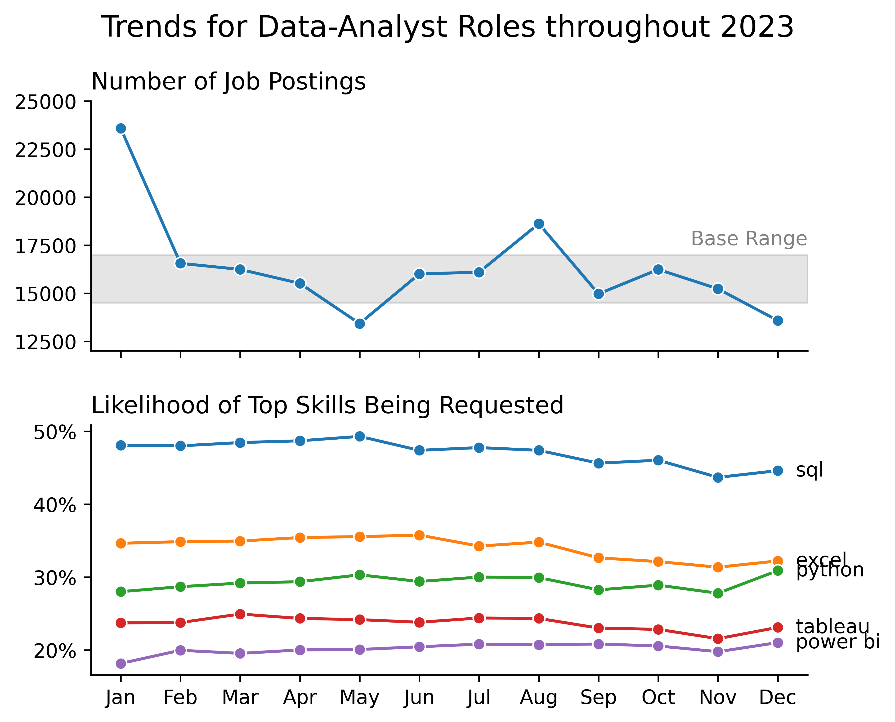

_An ad-hoc base range was added in the top graph to highlight months with few/numerous job postings, whose job counts are outside this range._

- (Top) Most data-analyst jobs were posted in January 2023.
- (Top) There was a resurgence in data-analyst job postings in August 2023.
- (Top) Among the remaining months, May and December 2023 showed fewer data-analyst job postings.
- (Bottom) While the number of job postings was quite time-dependent, the likelihood of top skills being requested in data-analyst job postings was rather constant throughout 2023.

Importantly, the number of job postings and skill likelihood behave similarly for other main data roles. This indicates that while the number of job postings fluctuated during 2023, the skill expectations for main data roles remained the same throughout the year.


## Which data roles and skills are associated with higher salaries?

The Python code yielding the analysis/visualization below can be found in the Jupyter Notebook [4_salary_analysis.ipynb](/python_data_job_analysis/4_salary_analysis.ipynb).

### Salary distributions for most popular data roles

Data was filtered to only keep entries with non-null salary information and the most popular roles were identified as having the larges total numbers of job postings.

```python
# Pre-filter data to only keep entries with non-null salary_year_avg
df_relevant = df.dropna(subset='salary_year_avg').copy()

# Isolate top jobs (based on total number of job postings)
n_jobs = 6
job_titles = df_relevant['job_title_short'].value_counts().index[:n_jobs].tolist()
df_top_jobs = df_relevant[df_relevant['job_title_short'].isin(job_titles)]

# Get the job order associated with descending median salary
job_order = df_top_jobs.groupby('job_title_short')['salary_year_avg'].median()
job_order = job_order.sort_values(ascending=False).index
```

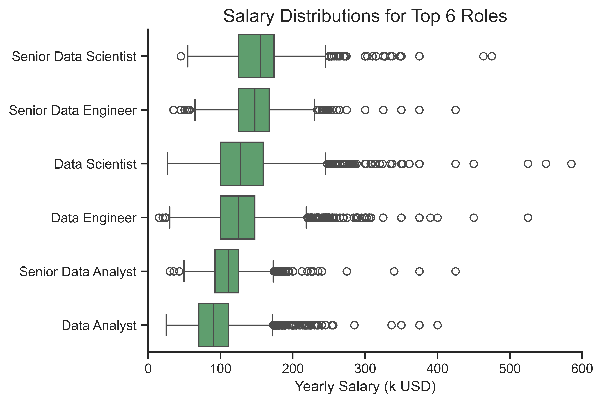

- Median salaries increase with seniority and specialization of the roles, the highest median salary being associated with the role of senior data scientist.
- All roles present wide collections of outliers on the higher end of the salary spectrum, which may be due to varying levels of expectations (in terms of skill/responsibility) across job postings.

### Comparing salaries between highest paid skills and most requested skills

Here, we focused on data-analyst job-postings as an example, still filtering the data to only keep entries with non-null salary information.

```python
job_title = 'Data Analyst'
n_skills = 10

# Pre-filter data to only keep data-analyst entries with non-null salary_year_avg
df_relevant = df[df['job_title_short'] == job_title].copy()
df_relevant = df_relevant.dropna(subset='salary_year_avg')

# Explode job skills
df_skills = df_relevant.explode('job_skills')

# Group by job_skills and aggregate to get skill count and median salary
df_skills = df_skills.groupby('job_skills')['salary_year_avg'].agg(['count', 'median'])

# Highest paid skills
df_skills_highest_pay = df_skills.sort_values('median', ascending=False).head(n_skills)

# Most requested skills (sorted by median salary)
df_skills_most_requested = df_skills.sort_values('count', ascending=False).head(n_skills)
df_skills_most_requested = df_skills_most_requested.sort_values(by='median', ascending=False)
```

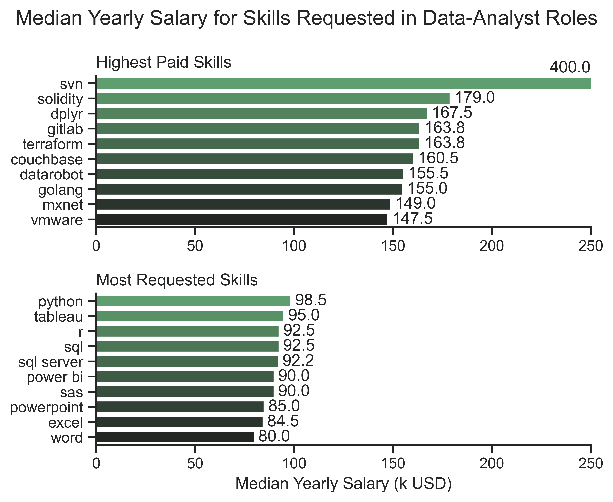

_The top graph, displaying the highest paid skills, was truncated because `svn` appeared as a clear outlier with a median salary of 400k USD._

- Besides the `svn` outlier, `solidity`, `svn` and `gitlab`/`terraform` (_ex-aequo_) are the highest paid skills, suggesting that advanced technical proficiency can lead to higher salaries.
- Although they are associated with lower median salaries, `python`, `tableau` and `r`/`sql` (_ex-aequo_) are the most requested skills.
- Most requested skills are typically associated with ~60% of the median salary characterizing the highest paid skills, which may give incentive to data analysts to develop a diverse skillset mixing fundamental and niche skills.


## What are the most optimal skills to learn?

The Python code yielding the analysis/visualization below can be found in the Jupyter Notebook [5_optimal_skills.ipynb](/python_data_job_analysis/5_optimal_skills.ipynb).

Here, a skill is deemed "optimal" if it is highly requested while being associated with a large median yearly salary. Thus, a 2D visualization appears most suited to address the problem at hand. We compared the cases of data-analyst and data-scientist job-postings. The general code for one of these cases goes as follows:

```python
# Isolate data-analyst jobs that have non-null salary_year_avg values
job_title = 'Data Analyst'
df_relevant = df[df['job_title_short'] == job_title].dropna(subset='salary_year_avg').copy()

# Number of jobs
n_jobs = len(df_relevant)

# Explode job_skills
df_skills = df_relevant.explode('job_skills')

# Group by skills and compute median yearly salary
df_skills = df_skills.groupby('job_skills')['salary_year_avg'].agg(['count', 'median'])
df_skills = df_skills.rename(columns={'count': 'skill_count',
                                      'median': 'median_salary'})

# Sort by descending count
df_skills = df_skills.sort_values('skill_count', ascending=False)

# Compute likelihood
df_skills['skill_likelihood'] = 100*df_skills['skill_count']/n_jobs

# Filter out skills that are below a certain skill_likelihood (for visualization)
likelihood_threshold = 5  # [%]
df_skills_most_requested = df_skills[df_skills['skill_likelihood'] > likelihood_threshold]
```

### Data-analyst case

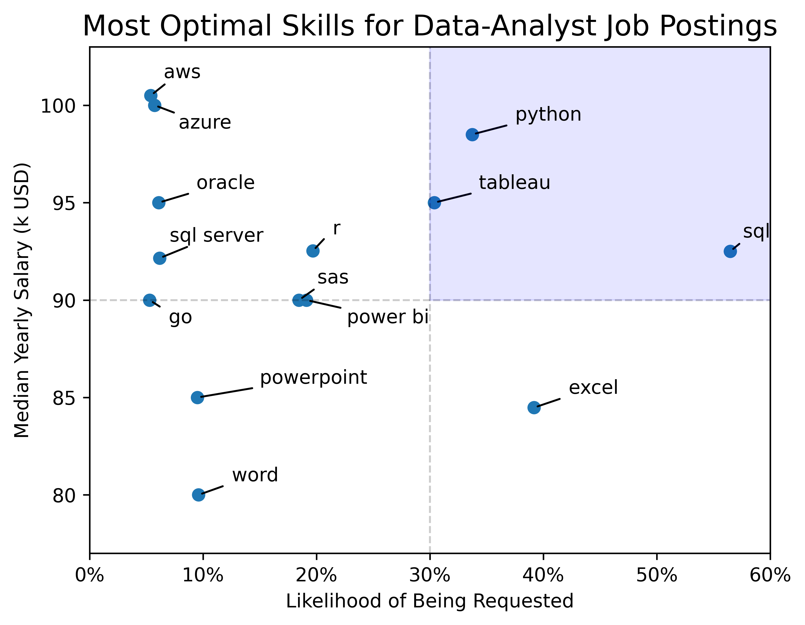

_Ad-hoc quadrants were drawn to highlight the skills that appear to be most optimal (in the top-right quadrant)._

- The fundamental skills `python`, `sql` and `tableau` are the ones associated with a high demand and a high median yearly salary (and are therefore deemed "optimal").
- `aws` and `azure` have the highest median yearly salaries while having non-negligible demand.
- `excel` has a high demand but is in the lower range of median yearly salaries.
- `word` has the lowest demand and median yearly salary.

### Data-scientist case

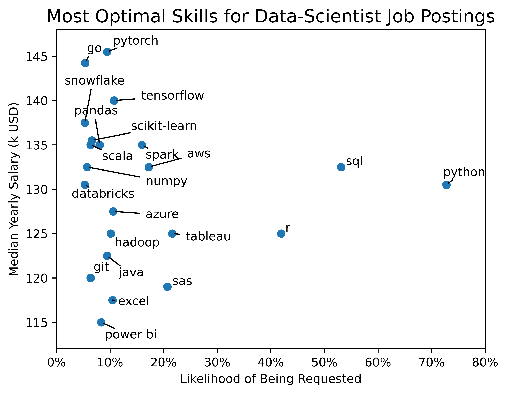

- The skill distribution for data scientists is quite different compared to the skill distribution for data analysts, as there is no skill that could be clearly classified as "optimal" here:
    - `sql`, `python` and `r` are clear outliers with their high demand, but are associated with average median yearly salaries.
    - a large collection of skills gathers at low demand, with:
        - classical skills (_e.g._, `power bi`, `excel`, `git`) being in the low-salary range.
        - specialized skills such as machine-learning toolboxes (`scikit-learn`, `tensorflow` and `pytorch`) being in the high-salary range.
- This skill distribution reflects the higher technical specialization that data-scientist roles tend to have compared to data-analyst ones.
