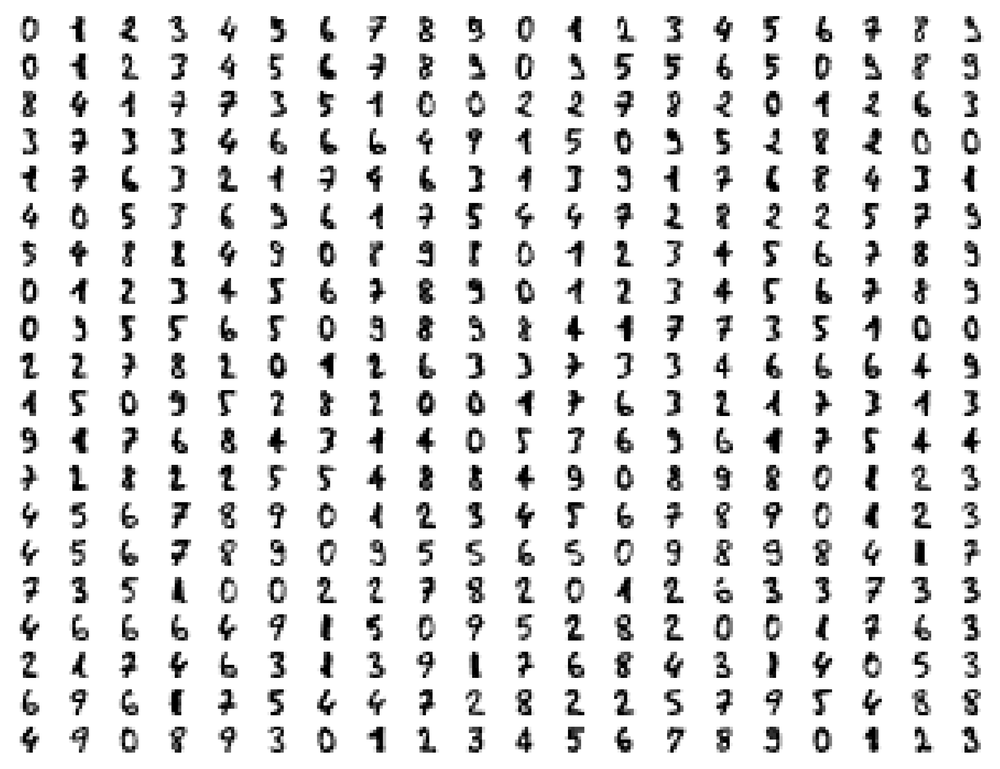
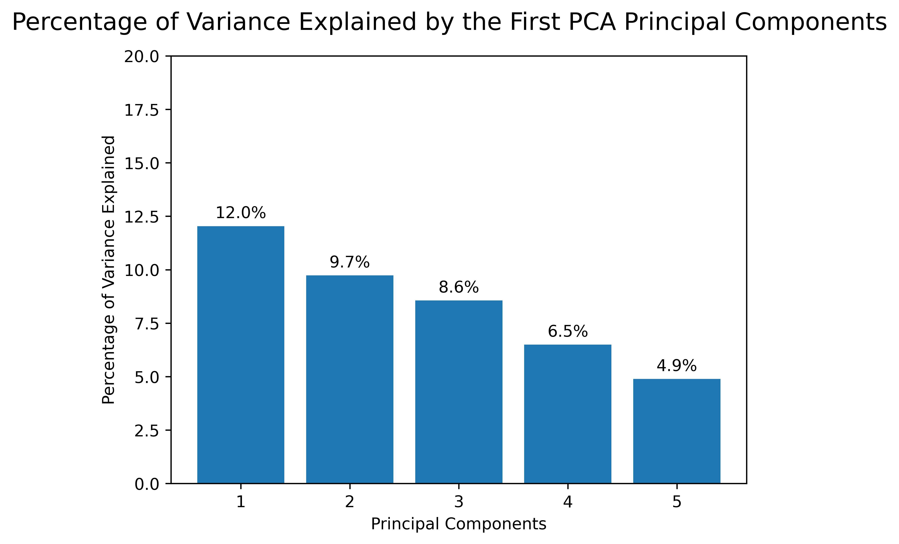
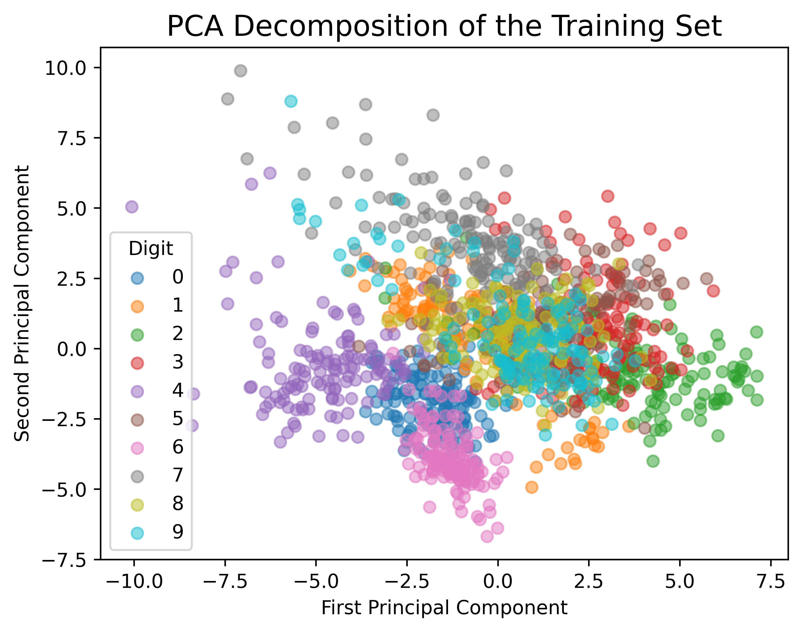
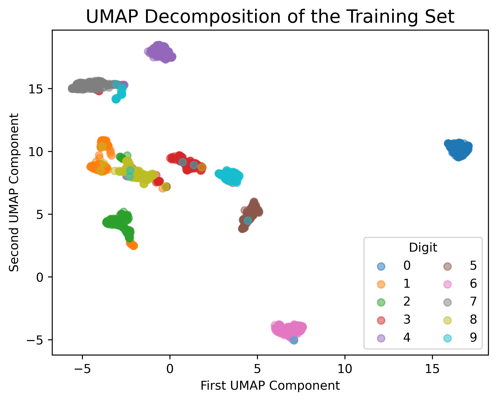
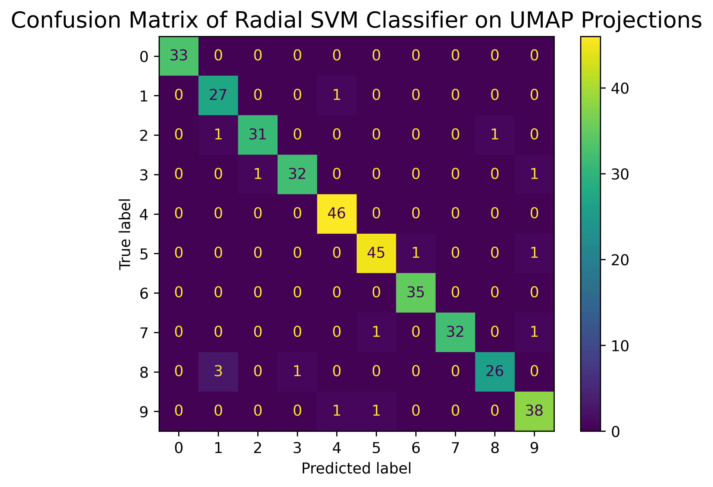
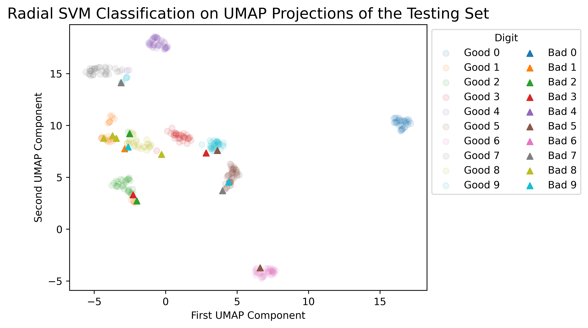

# Python project - Handwritten digit classification

## Introduction
This project aims at classify handwritten digits into 10 classes using dimensionality reduction and a classical machine-learning classifier.

Ideally, the classification should be visualizable in a 2D graph at the end (hence the dimensionality reduction).

## Tools I used
This project was carried out using the following tools:
- **Python (Numpy, Matplotlib)** - backbone of the data analysis and visualization.
- **Python (Scikit-Learn)** - machine learning toolbox.
- **Python (Umap)** - toolbox to run the Uniform Manifold Approximation and Projection (UMAP).
- **Jupyter Notebooks** - facilitating table and plot visualizations during the analysis.
- **Visual Studio Code** - my go-to code editor.
- **Git/Github** - essential for version control and code sharing.

## Project

The project was carried out in the Jupyter Notebook [digit_classification.ipynb](digit_classification.ipynb).

### Data loading and visualization

This rather balanced dataset contains 1797 handwritten digits as 8x8 pixel images (some of them are visualized below). Thus, there are 8x8=64 features for each image (_i.e._, the pixel intensities).

```python
from sklearn import datasets

# Load data
digits = datasets.load_digits()
X, y, images = digits.data, digits.target, digits.images
feature_names, label_names = digits.feature_names, digits.target_names.tolist()
label_names = [str(x) for x in label_names]
n_samples, n_features = X.shape
n_classes = len(label_names)
```



_Some handwritten digits from the dataset._


### Train/test split and feature scaling

The dataset was split into training and testing sets, and subsquently scaled using the standard strategy.

```python
# Train/test split
X_train, X_test, y_train, y_test = train_test_split(X, y, test_size=0.2, random_state=42)

# Feature scaling
scaler = StandardScaler()
X_train_scaled = scaler.fit_transform(X_train)
X_test_scaled = scaler.transform(X_test)
```


### Dimensionality reduction

#### Principal component analysis (PCA)

We investigate if PCA was a suitable dimensionality reduction technique for this dataset. The percentage of data variance explained by the first PCA components is visualized below.



- The percentage of explained variance is spread out across multiple principal components, with the first 4 components barely reaching 50% of explained variance. 
- Thus, PCA may not be quite suitable for the problem at hand, especially if we want to visualize the final classification in a 2D graph. 

This is confirmed in the figure below, showing the PCA decomposition of the training set wherein no clear digit clusters are teased apart. 

```python
from sklearn.decomposition import PCA

pca = PCA(n_components=2)
pca.fit(X_train_scaled)
X_train_scaled_pca = pca.transform(X_train_scaled)
```




#### Uniform Manifold Approximation and Projection (UMAP)

We instead investigated the potential of the Uniform Manifold Approximation and Projection (UMAP) for dimensionality reduction. The figure below shows the UMAP decomposition of the training set wherein clear digit clusters emerged. 

```python
from umap import UMAP

umap = UMAP(min_dist=0.0,
            n_components=2,
            n_jobs=1,
            random_state=42)
X_train_scaled_umap = umap.fit_transform(X_train_scaled)
X_test_scaled_umap = umap.transform(X_test_scaled)
```




Even though it is non-trivial to estimate the variance explained by a non-linear decomposition such as UMAP, it looks more promising than PCA for classification purposes.

### Radial support vector machine

Given some of the digit clusters above are disjoint, a radial support vector classifier may be best suited for the task. We perform hyperparameter tuning using cross-validated grid search. Even though the dataset is rather balanced, `class_weight` is set to `'balanced'`to mitigate any imbalance effect. 

```python
# Hyperparameter tuning using cross-validated grid search
param_grid = {
    'C': [0.1, 0.5, 1, 10, 50, 100, 150],
    'gamma': ['scale', 'auto', 0.1, 0.01, 0.001]
}

grid_search = GridSearchCV(
    estimator=SVC(kernel='rbf',
                  class_weight='balanced',
                  random_state=42),
    param_grid=param_grid,
    scoring='accuracy'
)
grid_search.fit(X_train_scaled_umap, y_train)

# Best estimator
model_svm_radial = grid_search.best_estimator_

# Evaluation
y_pred = model_svm_radial.predict(X_test_scaled_umap)
```

The confusion matrix of the radial SVM classifier on UMAP projections of the testing set is displayed below.



The radial SVM classifier reached an accuracy of 96% on the UMAP projections of the testing set.

Given the complexity of the classifier's decision boundary, we did not visualize it but rather plotted the projections that were correctly or incorrectly predicted for each digit below. For instance:
- "Good 0" represents true 0s that were correctly predicted.
- "Bad 0" represents true 0s that were incorrectly predicted.

In the case of a badly predicted projection, the actual model prediction can be inferred from the above confusion matrix and from the nearest-neighbor projections.

