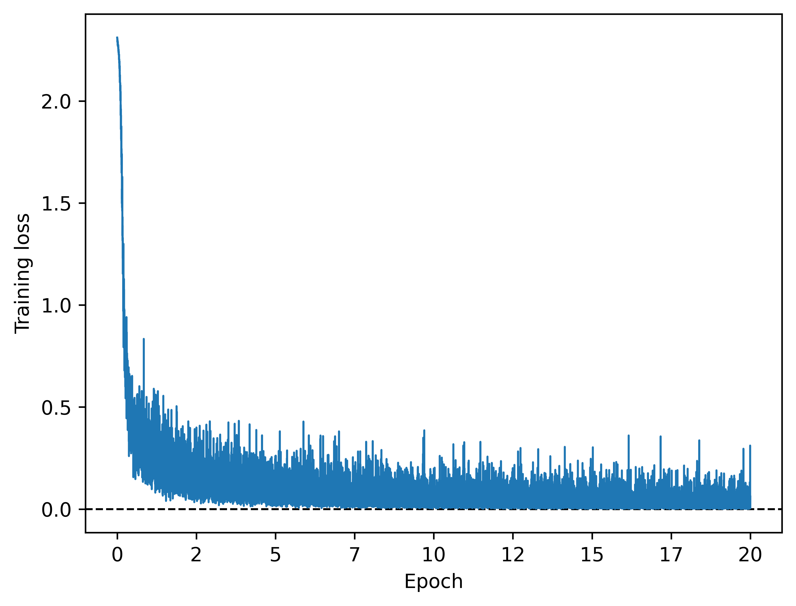

# Python project - Handwritten digit classification using LeNet-5 CNN

## Introduction
This project aims at classifying handwritten digits into 10 classes using a convolutional neural network.

## Tools I used
This project was carried out using the following tools:
- **Python (Numpy, Matplotlib)** - backbone of the data analysis and visualization.
- **Python (Pytorch)** - machine learning toolbox.
- **Jupyter Notebooks** - facilitating table and plot visualizations during the analysis.
- **Visual Studio Code** - my go-to code editor.
- **Git/Github** - essential for version control and code sharing.

## Project

The project was carried out in the Jupyter Notebook [cnn_classification.ipynb](cnn_classification.ipynb).

### Data loading and visualization

The MNIST dataset, containing 70000 black-and-white images, was loaded and interpolated to 32x32 pixel images.

```python
# Composition of transforms for our dataset (PIL images)
# The last normalization step rescales using the mean and std of the data
data_mean = 0.1307
data_std = 0.308
transform = transforms.Compose(
    [transforms.Resize(pixel_size),  # Bilinear interpolation
     transforms.ToTensor(),  # Conversion to tensor (float conversion and 0-1 rescaling)
     transforms.Normalize([data_mean], [data_std])]
)

# Loading MNIST dataset of handwritten digits
train_data = datasets.MNIST(data_dir,
                            train=True,
                            download=True,
                            transform=transform)
test_data = datasets.MNIST(data_dir,
                           train=False,
                           download=True,
                           transform=transform)

# Let us split the training set into train and validation sets
train_size = 0.9
n_samples_train = int(len(train_data)*train_size)
n_samples_val = len(train_data) - n_samples_train
train_data, val_data \
    = torch.utils.data.random_split(train_data,
                                    [n_samples_train, n_samples_val],
                                    generator=torch.Generator().manual_seed(42))
```


_Some digits from the dataset._


### LeNet-5 convolutional neural network (CNN) classifier

### Definition

We used the classical LeNet-5 neural network, one of the earliest convolutional neural networks (dating back to 1998). The model is defined below, along with methods for setting data loaders and optimizer parameters, and for carrying out its training and evaluation.

```python
class LeNet(nn.Module):
    def __init__(self,
                 n_channels: int,
                 pixel_size: int,
                 n_classes: int,
                 device) -> None:
        super().__init__()

        # Device configuration
        self.device = device

        # General architectural information
        self.activation = nn.ReLU()

        n_hidden_1 = 6
        n_hidden_2 = 16
        n_hidden_fc_1 = 120
        n_hidden_fc_2 = 84

        conv_kernel_size = 5
        pool_kernel_size = 2

        # Max pooling layer
        self.pool = nn.MaxPool2d(pool_kernel_size)

        # Convolutional layers
        self.conv1 = nn.Conv2d(n_channels, n_hidden_1, conv_kernel_size)
        self.conv2 = nn.Conv2d(n_hidden_1, n_hidden_2, conv_kernel_size)
        
        # What pixel_size becomes through the initial layers
        # To set the input size of the first fully connected layer
        output_size = pixel_size
        output_size -= (conv_kernel_size - 1)  # From conv1
        output_size \
            = np.floor((output_size - pool_kernel_size)/pool_kernel_size + 1).astype(int)  # After pooling
        output_size -= (conv_kernel_size - 1)  # From conv2
        output_size \
            = np.floor((output_size - pool_kernel_size)/pool_kernel_size + 1).astype(int)  # After pooling
        
        n_outputs_from_conv = n_hidden_2*output_size**2
        if n_outputs_from_conv <= 0:
            raise ValueError('n_outputs_from_conv <= 0, check other dimensions '
                             + 'to get n_outputs_from_conv > 0')    
        
        # Fully connected layers
        self.linear1 = nn.Linear(n_outputs_from_conv, n_hidden_fc_1)
        self.linear2 = nn.Linear(n_hidden_fc_1, n_hidden_fc_2)
        self.linear3 = nn.Linear(n_hidden_fc_2, n_classes)

        # Initialize loggers
        self.train_loss_logger = []
        self.train_accuracy_logger = []
        self.val_accuracy_logger = []


    def forward(self, x: torch.Tensor) -> torch.Tensor:
        # Let us assume our input x has shape 
        # (batch_size, n_channels=3, pixel_size=32, pixel_size=32)
        # and needs to be classified among n_classes=10 classes

        x = self.activation(self.conv1(x))      # (batch_size, 6, 28, 28)
        x = self.pool(x)                        # (batch_size, 6, 14, 14)
        x = self.activation(self.conv2(x))      # (batch_size, 16, 10, 10)
        x = self.pool(x)                        # (batch_size, 16, 5, 5)

        x = torch.flatten(x, 1)                 # (batch_size, 16*5*5=400)

        x = self.activation(self.linear1(x))    # (batch_size, 84)
        x = self.activation(self.linear2(x))    # (batch_size, 120)
        x = self.linear3(x)                     # (batch_size, n_classes=10)

        return x
    

    def set_data(self,
                 train_data,
                 val_data,
                 test_data,
                 batch_size) -> None:
        # Set data loaders
        self.train_loader = dataloader.DataLoader(train_data,
                                                  shuffle=True,
                                                  batch_size=batch_size)
        self.val_loader = dataloader.DataLoader(val_data,
                                                shuffle=False,
                                                batch_size=batch_size)
        self.test_loader = dataloader.DataLoader(test_data,
                                                 shuffle=False,
                                                 batch_size=batch_size)
    

    def set_optimizer(self, learning_rate, loss_function):
        # Set optimizer parameters
        self.optimizer = optim.Adam(self.parameters(), lr=learning_rate)
        self.loss_function = loss_function


    def train_model(self) -> None:
        self.train(True)

        for _, (x, y) in enumerate(tqdm(self.train_loader, leave=False, desc='Training')):
            fx = self.forward(x.to(self.device))
            loss = self.loss_function(fx, y.to(self.device))

            self.optimizer.zero_grad()
            loss.backward()
            self.optimizer.step()

            self.train_loss_logger.append(loss.item())


    def evaluate_accuracy(self, which_data: str) -> float:
        self.train(False)

        # Choose data loader
        if which_data.lower() == 'train':
            loader = self.train_loader
        elif which_data.lower() == 'val':
            loader = self.val_loader
        elif which_data.lower() == 'test':
            loader = self.test_loader
        else:
            raise ValueError('which_data should be train, val or test')

        # Compute accuracy
        accuracy = 0.
        with torch.no_grad():
            for _, (x, y) in enumerate(tqdm(loader, leave=False, desc='Evaluating')):
                fx = self.forward(x.to(self.device))
                matches = (fx.argmax(1) == y.to(self.device))
                accuracy += matches.sum().item()
        accuracy = accuracy/len(loader.dataset)

        # Update loggers if relevant
        if which_data.lower() == 'train':
            self.train_accuracy_logger.append(accuracy)
        elif which_data.lower() == 'val':
            self.val_accuracy_logger.append(accuracy)

        return accuracy  
```

### Training

The model was set up and trained below.

```python 
# Set up model, data and optimizer
model = LeNet(n_channels=n_channels,
              pixel_size=pixel_size,
              n_classes=n_classes,
              device=device).to(device)

model.set_data(train_data=train_data,
               val_data=val_data,
               test_data=test_data,
               batch_size=batch_size)

model.set_optimizer(learning_rate=learning_rate,
                    loss_function=nn.CrossEntropyLoss())

for epoch in trange(n_epochs, leave=False, desc='Epoch'):
    # Train
    model.train_model()
    
    # Evaluate and log accuracy on training and validation sets
    _ = model.evaluate_accuracy(which_data='train')
    _ = model.evaluate_accuracy(which_data='val')
```

The training loss, training accuracy and validation accuracy are visualized below.



The training loss is rather noisy, as one would expect when using mini-batch gradient descent.


The training accuracy overshoots the validation accuracy, which may indicate some overfitting (assuming the training and validation sets share the exact same distribution).

### Evaluation

#### Accuracy

```python
testing_accuracy = model.evaluate_accuracy(which_data='test')
```

The evaluation of the model on the testing dataset yielded an accuracy of 98.8%.

#### Feature maps

Some feature maps were also investigated using code similar to below, to get a sense of the kind of information the network was leveraging.

```python
# Visualizations of a feature after relu(conv1)
n_images = 16
idx_feature = 3

with torch.no_grad():
    model_out = F.relu(model.conv1(images.to(device)))
feature_maps = model_out[:n_images, idx_feature].unsqueeze(1).detach().cpu()

_, ax = plt.subplots(2, 1)

out = torchvision.utils.make_grid(images[:n_images], n_images//2, normalize=True)
ax[0].imshow(out.numpy().transpose((1, 2, 0)))
ax[0].tick_params(axis='both',
                  which='both',
                  left=False,
                  labelleft=False,
                  bottom=False,
                  labelbottom=False)
ax[0].set_title('Original Images', fontsize=15)

out = torchvision.utils.make_grid(feature_maps, n_images//2, normalize=True)
ax[1].imshow(out.numpy().transpose((1, 2, 0)))
ax[1].tick_params(axis='both',
                  which='both',
                  left=False,
                  labelleft=False,
                  bottom=False,
                  labelbottom=False)
ax[1].set_title('A Type of Feature Maps after relu(conv1)', fontsize=15)
plt.tight_layout(h_pad=1)
plt.savefig(os.path.join(fig_dir, '5_feature_map_1.png'),
            bbox_inches='tight', dpi=600)
plt.show()
```


These feature maps seem to detect edges going (from bottom to top) from dark to bright.


These feature maps seem to detect diagonal lines from top-right to bottom-left.