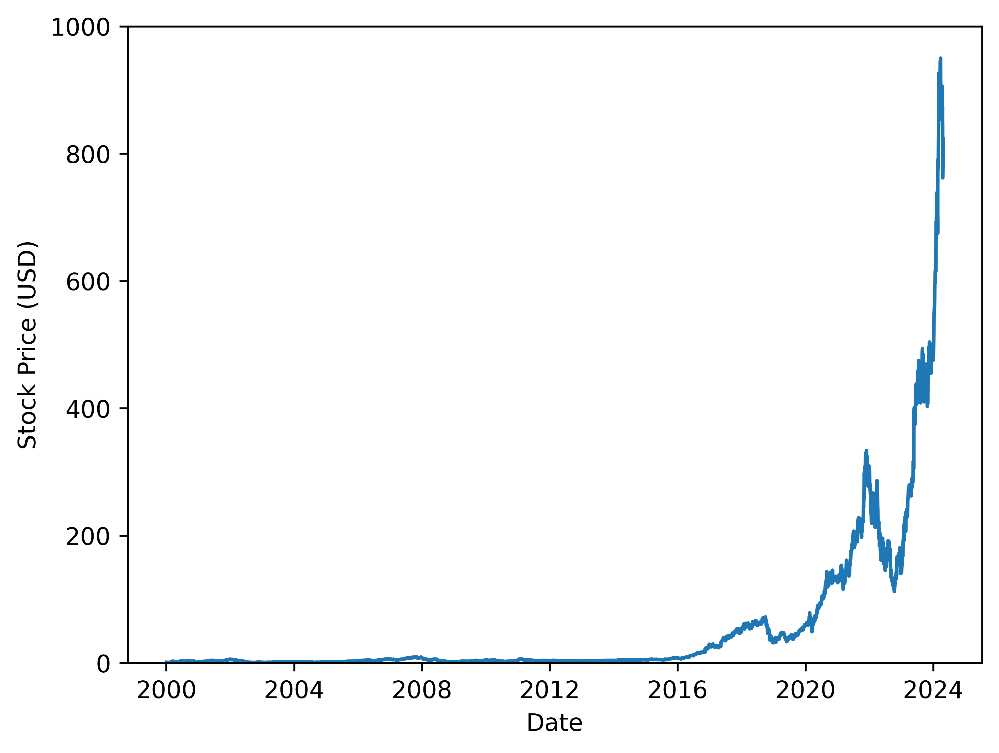

# Python project - NVIDIA stock price prediction

## Introduction
This project aims at predicting NVIDIA's stock price, based on the [NVDA Kaggle dataset](https://www.kaggle.com/datasets/prajwaldongre/nvidia-corp-share-price-2000-2024) that covers the company's stock prices from 2000 to 2024.

## Tools I used
This project was carried out using the following tools:
- **Python (Pandas, Matplotlib, Seaborn)** - backbone of the data preprocessing and visualization.
- **Pytorch** - machine learning toolbox.
- **Jupyter Notebooks** - facilitating table and plot visualizations during the analysis.
- **Visual Studio Code** - my go-to code editor.
- **Git/Github** - essential for version control and code sharing.

## Project

All relevant code is contained in the Jupyter Notebook [nvidia_stock_price_prediction.ipynb](nvidia_stock_price_prediction.ipynb).

### Data loading

Data was loaded according to the following code and is visualized below.

```python
# Load data
df = pd.read_csv('NVDA.csv')

# Convert date to datetime format and sort (just in case)
df['Date'] = pd.to_datetime(df['Date'])
df = df.sort_values('Date')
```



_Visualization of the original stock price._

- Given we are dealing with a time serie, a **long short-term memory (LSTM) network** should be well suited to predict the stock price.
- Note that the stock price is rather flat before 2017, so we will focus on the stock prices covering the **2017-2024 period**.

### Data preparation

The data was first:
- selected over the 2017-2024 period.
- interpolated so that it contains entries for all days in 2017-2024.

```python
# Isolate relevant time period (the stock price is rather flat before 2017)
df_daily = df[df['Date'].dt.year >= 2017].copy()

# Set daily frequency and interpolate missing values
df_daily = df_daily.copy()
df_daily = df_daily.set_index('Date').asfreq('D')
df_daily = df_daily.interpolate(method='time', axis=0)
df_daily = df_daily.reset_index()

# Store time and price in Numpy arrays
time = df_daily.index.to_numpy(dtype=np.int32)
price = df_daily['Close'].to_numpy(dtype=np.float32)
```

Data was then:
- scaled (using the min-max strategy).
- processed using a lookback window in preparation for LSTM training.
- split into training and testing datasets.
- reshaped and converted to `torch` tensors.

```python
def generate_feature_target(data: NDArray,
                            lookback: int = 1) -> Tuple[NDArray, NDArray]:
    """
    Convert a data array into feature and target arrays
    """

    X, y = [], []
    for i in range(len(data) - lookback - 1):
        a = data[i:(i+lookback), 0]
        X.append(a)
        y.append(data[i + lookback, 0])

    return np.array(X), np.array(y)


# General parameters for below
lookback = 4
relative_train_size = 0.7

# Reshape and scale data
scaler = MinMaxScaler(feature_range=(-1, 1))
price = price.reshape(-1, 1)
price = scaler.fit_transform(price)

# Prepare data for LSTM with lookback window
X, y = generate_feature_target(price, lookback)
time_lookback = time[lookback:-1]

# Split data into training and testing sets
idx_split = int(X.shape[0]*relative_train_size)
X_train, X_test = X[:idx_split, :], X[idx_split:, :]
y_train, y_test = y[:idx_split], y[idx_split:]
time_train, time_test = time_lookback[:idx_split], time_lookback[idx_split:]

# Final reshaping
X_train = X_train.reshape((-1, lookback, 1))
X_test = X_test.reshape((-1, lookback, 1))
y_train = y_train.reshape((-1, 1))
y_test = y_test.reshape((-1, 1))

# Convert to torch tensors
X_train = torch.tensor(X_train, dtype=torch.float32)
X_test = torch.tensor(X_test, dtype=torch.float32)
y_train = torch.tensor(y_train, dtype=torch.float32)
y_test = torch.tensor(y_test, dtype=torch.float32)
```

Finally the training and testing datasets were combined and stored in data loaders with a specified batch size.

```python
class timeseries(Dataset):
    def __init__(self, X: torch.Tensor, y: torch.Tensor):
        self.X = X
        self.y = y
        self.len = X.shape[0]

    def __getitem__(self, idx: int):
        return self.X[idx], self.y[idx]

    def __len__(self):
        return self.len


# Combine and store data
batch_size = 256

train_dataset = timeseries(X_train, y_train)
test_dataset = timeseries(X_test, y_test)

train_loader = DataLoader(dataset=train_dataset,
                          batch_size=batch_size,
                          shuffle=True)
test_loader = DataLoader(dataset=test_dataset,
                         batch_size=batch_size,
                         shuffle=False)
```


_Visualization of the time spans covered by the training and testing datasets over the 2017-2024 period._

### LSTM model definition and training

The LSTM-network architecture was defined as follows:
1. stacked LSTM layers.
2. dropout layer (to prevent overfitting).
3. fully connected layer.

```python
# Define model
class LSTM(nn.Module):
    def __init__(self,
                 input_size: int,
                 hidden_size: int,
                 num_stacked_layers: int,
                 fraction_dropout: float = 0.2) -> None:
        super().__init__()
        self.hidden_size = hidden_size
        self.num_stacked_layers = num_stacked_layers

        # Stacked LSTM layers
        self.lstm = nn.LSTM(input_size=input_size,
                            hidden_size=hidden_size,
                            num_layers=num_stacked_layers,
                            batch_first=True)
        
        # Fully connected layer after LSTM layers
        self.fc = nn.Linear(in_features=hidden_size,
                            out_features=1)
        
        # Define the fraction of neurons to dropout (to prevent overfitting)
        if (fraction_dropout < 0) or (fraction_dropout > 1):
            raise ValueError('fraction_dropout should be in [0, 1]')
        self.dropout = nn.Dropout(fraction_dropout)

    def forward(self, x: torch.Tensor) -> torch.Tensor:
        batch_size = x.size(0)

        # Hidden and current data
        h0 = torch.zeros(self.num_stacked_layers, batch_size, self.hidden_size)
        c0 = torch.zeros(self.num_stacked_layers, batch_size, self.hidden_size)
        
        # LSTM layers followed by fully connected layer
        out, _ = self.lstm(x, (h0, c0))
        out = self.dropout(out)
        out = self.fc(out[:, -1, :])

        return out
```

The model and optimization hyperparameters were then set and the model was subsequently trained.

```python
# Model hyperparameters
hidden_size = 150
num_stacked_layers = 2
fraction_dropout = 0.25
model = LSTM(1, hidden_size, num_stacked_layers, fraction_dropout)

# Optimization hyperparameters
num_epochs = 50
learning_rate = 0.01
loss_function = nn.MSELoss()
optimizer = torch.optim.Adam(model.parameters(), lr=learning_rate)
```


### LSTM model evaluation

The model fit on the training data and the model prediction on the testing data were computed as follows.

```python
with torch.no_grad():
    train_prediction = model(train_dataset.X).numpy()
    test_prediction = model(test_dataset.X).numpy()
```


_Comparison between the model fit and the original training data (after undoing the min-max scaler transform)._


_Comparison between the model prediction and the original testing data (after undoing the min-max scaler transform)._