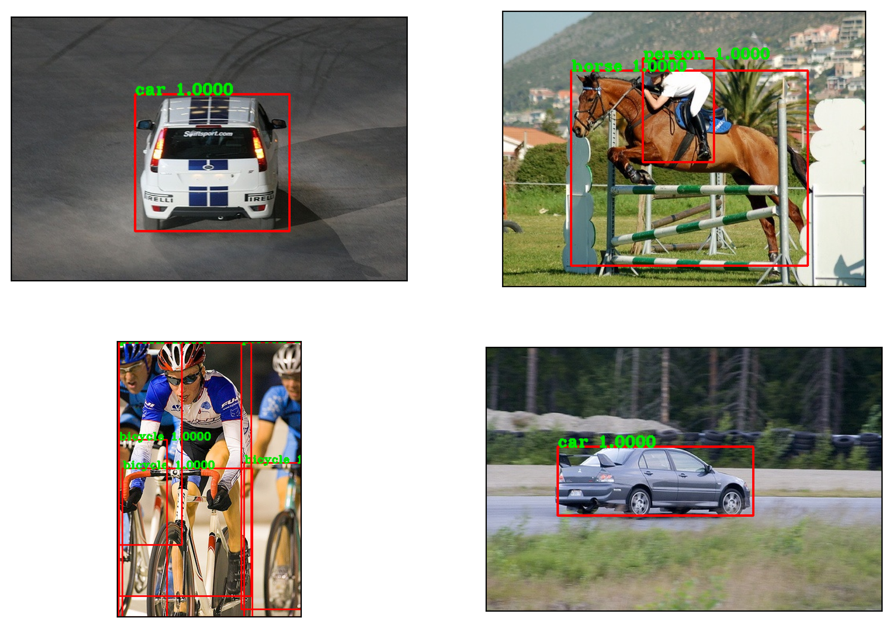
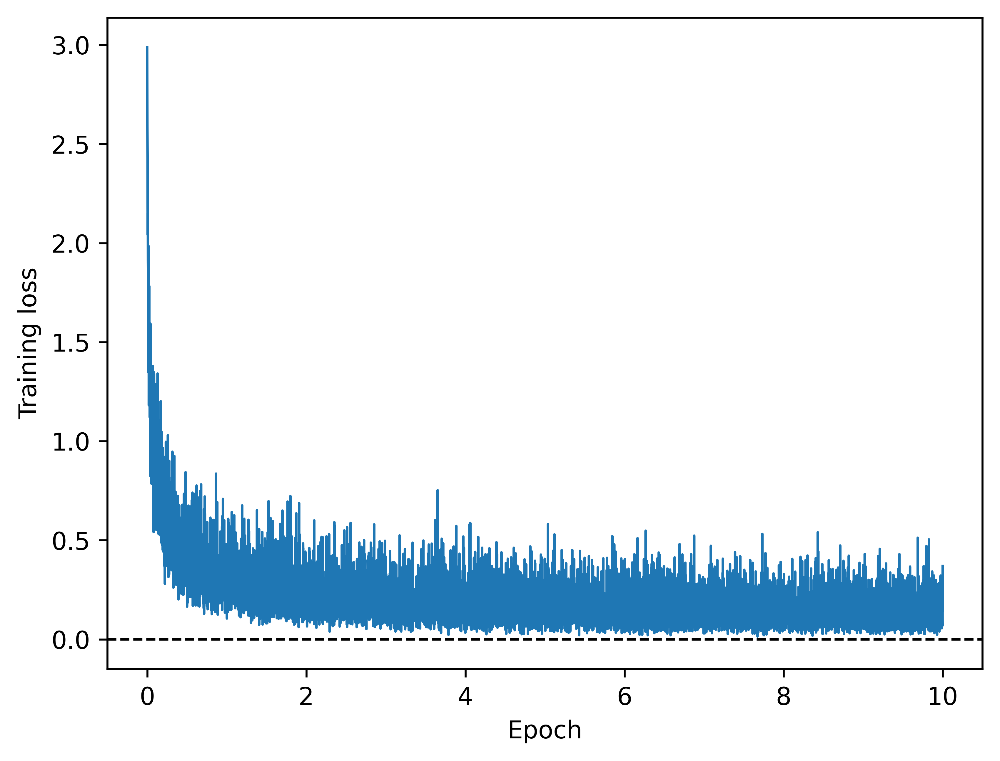
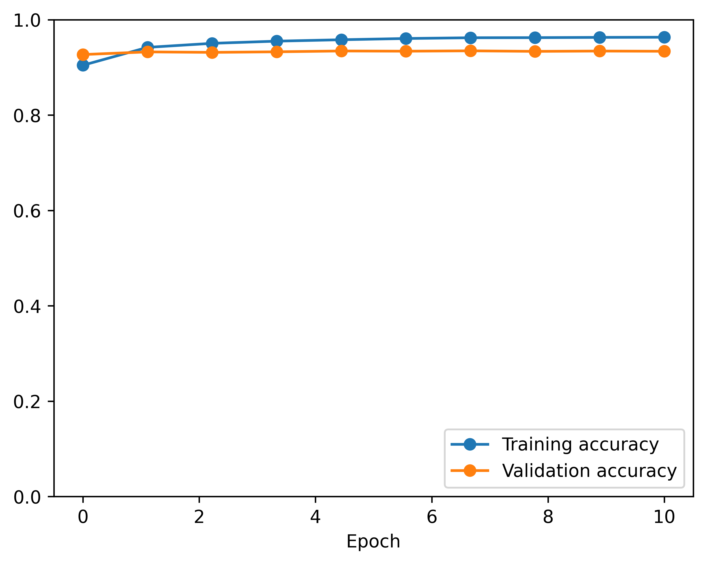
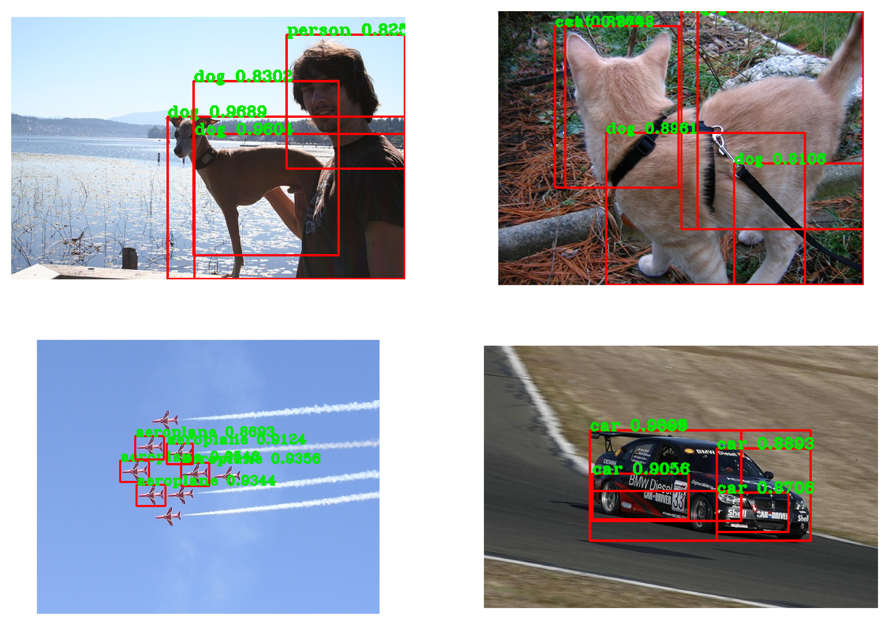

# Python project - Object detection using a region-based convolutional neural network (R-CNN)

## Introduction
This project aims at detecting and identifying objects in images. This is achieved using a region-based convolutional neural network (R-CNN) to classify objects across 20 categories and detect them in images using bounding boxes.

While being too slow for real-time object detection, unlike models like You Only Look Once (YOLO), R-CNNs generally present high accuracy and are based on an interesting learning strategy that separates detecting and classifying objects:
1. Image sections are isolated within regions obtained via selective-search segmentation (this is the core of R-CNNs' detection aspect).
2. These sections are then assigned a label based on the ground-truth labels and the sections' similarities to the ground-truth bounding boxes (using intersection over union).
3. The model is trained to classify these image sections.
4. During inference, new regions are generated via selective-search segmentation and fed to the model for classification, with the most relevant regions being later selected based on classification and spatial-overlap criteria (see non-maximum suppression below).

## Tools I used
This project was carried out using the following tools:
- **Python (Numpy, Matplotlib)** - backbone of the data analysis and visualization.
- **Python (Pytorch)** - machine learning toolbox.
- **Jupyter Notebooks** - facilitating table and plot visualizations during the analysis.
- **Visual Studio Code** - my go-to code editor.
- **Git/Github** - essential for version control and code sharing.

## Project

The project was carried out in the Jupyter Notebook [detection.ipynb](detection.ipynb).

### Data loading and visualization

The PASCAL VOC (Visual Object Classes) dataset is a renowned benchmark for object detection, segmentation, and classification in computer vision. It includes comprehensive annotations like bounding boxes, class labels, and segmentation masks across 20 different object categories.

```python
# Data loading
voc_dataset_train = datasets.VOCDetection(root=data_dir,
                                          image_set='train',
                                          download=True,
                                          year='2007')
voc_dataset_val = datasets.VOCDetection(root=data_dir,
                                        image_set='val',
                                        download=True,
                                        year='2007')
voc_dataset_test = datasets.VOCDetection(root=data_dir,
                                         image_set='test',
                                         download=True,
                                         year='2007')

# Dataset labels 
# (Make sure 'background' has index 0 in this list)
data_labels = ['background', 'pottedplant', 'person', 'motorbike',
               'train', 'dog', 'diningtable', 'horse',
               'bus', 'aeroplane', 'sofa', 'sheep',
               'tvmonitor', 'bird', 'bottle', 'chair',
               'cat', 'bicycle', 'cow', 'boat', 'car']
```

Some images and bounding boxes from the training datasets are shown below.




### Data preparation for model training

Region-based convolutional neural networks (R-CNNs) require a rather intricate data preparation. 

Firstly, we generated image sections for the training and validation datasets using boxes generated via selective-search segmentation. To better train our model, we kept boxes that do not greatly match ground-truth bounding boxes and labelled them as 0 (background).

```python
def compute_iou(box_1: list[int],
                box_2: list[int]) -> float:
    # Intersection over union

    x1_b1, y1_b1, x2_b1, y2_b1 = tuple(box_1)
    x1_b2, y1_b2, x2_b2, y2_b2 = tuple(box_2)

    x1 = np.maximum(x1_b1, x1_b2)
    y1 = np.maximum(y1_b1, y1_b2)
    x2 = np.minimum(x2_b1, x2_b2)
    y2 = np.minimum(y2_b1, y2_b2)

    area_of_intersection = max(0, x2 - x1 + 1)*max(0, y2 - y1 + 1)
    area_box_1 = (x2_b1 - x1_b1 + 1)*(y2_b1 - y1_b1 + 1)
    area_box_2 = (x2_b2 - x1_b2 + 1)*(y2_b2 - y1_b2 + 1)
    area_of_union = area_box_1 + area_box_2 - area_of_intersection

    return area_of_intersection/float(area_of_union)


def generate_image_sections_from_proposals(image: NDArray,
                                           box_annotations: list[dict],
                                           region_proposals: NDArray,
                                           data_labels: list[str],
                                           iou_threshold: float,
                                           max_n_boxes: int,
                                           fraction_background: float = 0.5
                                           ) -> Tuple[list[NDArray], list[int]]:
    # To better train our model, we keep boxes that do not greatly match
    # ground-truth bounding boxes and label them as 0 (background)
    # (The target is fraction_background*max_n_boxes of such boxes 
    #  and (1-fraction_background)*max_n_boxes boxes that better match the ground-truth)
    background_count = 0
    non_background_count = 0
    max_background_count = int(fraction_background*max_n_boxes)
    max_non_background_count = max_n_boxes - max_background_count
    
    # Go through box annotations and region proposals
    image_sections = []
    classes = []
    for annotation in box_annotations:
        # Ground-truth information
        label = annotation['name']
        box = [int(v) for _, v in annotation['bndbox'].items()]
        box = np.array(box)

        # Select region proposals
        for region in region_proposals:
            if (non_background_count > max_non_background_count) \
                    and (background_count > max_background_count):
                break
            else:
                iou_score = compute_iou(region, box)
                if (iou_score >= iou_threshold) \
                        and (non_background_count <= max_non_background_count):
                    # Keep box containing object
                    x1, y1, x2, y2 = region
                    img_section = image[y1:y2, x1:x2]
                    image_sections.append(img_section)
                    classes.append(data_labels.index(label))
                    non_background_count += 1
                elif background_count <= max_background_count:
                    # Keep box that does not contain an object
                    x1, y1, x2, y2 = region
                    img_section = image[y1:y2, x1:x2]
                    image_sections.append(img_section)
                    classes.append(0)  # Background label
                    background_count += 1

    return image_sections, classes


def prepare_data_for_rcnn(dataset,
                          output_dir: str,
                          iou_threshold: float,
                          max_n_boxes: int,
                          selective_search_params: dict,
                          fraction_background: float = 0.5) -> None:
    # Check if data was not already processed
    if len(os.listdir(output_dir)) < 1000:
        # Read parameters from selective_search_params
        scale = selective_search_params['scale']
        sigma = selective_search_params['sigma']
        min_size = selective_search_params['min_size']
        max_n_proposals = selective_search_params['max_n_proposals']

        all_images = []
        all_labels = []
        for image, annotations in tqdm(dataset):
            image = np.array(image)
            box_annotations = annotations['annotation']['object']

            # Selective search algorithm for generating region proposals 
            # by merging similar pixels into regions
            _, region_proposals \
                = selectivesearch.selective_search(image,
                                                   scale=scale,
                                                   sigma=sigma,
                                                   min_size=min_size)
            region_proposals = [r['rect'] for r in region_proposals]
            region_proposals = [[x, y, x+w, y+h]
                                for x, y, w, h in region_proposals
                                if (w != 0) and (h != 0)]
            region_proposals = np.array(region_proposals[:max_n_proposals])

            # Image sections for RCNN
            image_sections, classes \
                = generate_image_sections_from_proposals(image,
                                                         box_annotations,
                                                         region_proposals,
                                                         data_labels,
                                                         iou_threshold,
                                                         max_n_boxes,
                                                         fraction_background)
            # Concatenate output lists
            all_images += image_sections
            all_labels += classes

        # Saving processed data to pickle file
        for idx, (image, label) in enumerate(zip(all_images, all_labels)):
            pickle_path = os.path.join(output_dir, f'img_{idx}.pkl')
            with open(pickle_path, 'wb') as f:
                pickle.dump({'image': image, 'label': label}, f)
    else:
        print(f'Data already prepared in {output_dir}')
```

We then declared a dataset class for our image sections and bounding boxes.

```python
class RCNNDataset(Dataset):
    def __init__(self,
                 data_folder: str,
                 image_section_dim: Tuple[int, int]) -> None:
        super().__init__()
        self.data_files = list(map(lambda x: os.path.join(data_folder, x),
                                   os.listdir(data_folder)))
        self.image_section_dim = image_section_dim
        self.transform = transforms.Normalize([0.485, 0.456, 0.406],
                                              [0.229, 0.224, 0.225])

    def __getitem__(self, idx: int) -> Tuple[torch.Tensor, torch.Tensor]:
        with open(self.data_files[idx], 'rb') as pkl:
            data = pickle.load(pkl)
        image, label = data['image'], data['label']
        
        # Resize, convert, transform image
        image = cv2.resize(image, self.image_section_dim)
        image = np.asarray(image, dtype=np.float32)
        image = torch.from_numpy(image)
        image = torch.permute(image, (2, 0, 1))
        image = self.transform(image)
        
        # Convert label
        label = torch.tensor(label)
        
        return image, label
    
    def __len__(self) -> int:
        return len(self.data_files)
```

We finally generated the datasets and associated data loaders.

```python
iou_threshold = 0.7
max_n_boxes = 50
selective_search_params = {
    'scale': 300.,           # large values result in fewer regions but potentially higher quality
    'sigma': 0.8,            # std of Gaussian function smoothing the image
    'min_size': 50,          # discard too-small regions
    'max_n_proposals': 1000  # maximal number of proposals retained
}
fraction_background = 0.5  # fraction of background image sections in final dataset

pixel_size = 224
batch_size = 64

# Prepare datasets
prepare_data_for_rcnn(voc_dataset_train,
                      rcnn_train_data_dir,
                      iou_threshold,
                      max_n_boxes,
                      selective_search_params,
                      fraction_background)
prepare_data_for_rcnn(voc_dataset_val,
                      rcnn_val_data_dir,
                      iou_threshold,
                      max_n_boxes,
                      selective_search_params,
                      fraction_background)

# Use dataset class
train_dataset = RCNNDataset(data_folder=rcnn_train_data_dir,
                            image_section_dim=(pixel_size, pixel_size))
val_dataset = RCNNDataset(data_folder=rcnn_val_data_dir,
                          image_section_dim=(pixel_size, pixel_size))

# Define data loaders
train_loader = DataLoader(train_dataset,
                          batch_size=batch_size,
                          shuffle=True)
val_loader = DataLoader(val_dataset,
                        batch_size=batch_size,
                        shuffle=False)
```

Some example image sections and their associated labels are shown below.


### Region-based convolutional neural network (R-CNN)

We loaded and froze a pretrained ResNet50 model as base model and subsequently altered its final classification layer to match our problem, thereby taking advantage of transfer learning. This model had 24,567,893 parameters, 1,059,861 of which were trained.

```python
# Load and freeze pretrained resnet
model = models.resnet50(weights='IMAGENET1K_V2')
for param in model.parameters():
    param.requires_grad = False

# Modify the model's last fully connected layer
# to adapt it to our problem and incorporate dropout
n_labels = len(data_labels)
n_hidden = 512  # Corresponds to n_features/4 below
dropout = 0.2

n_features = model.fc.in_features  # This is 2048 in the original model
model.fc = nn.Sequential(nn.Dropout(dropout),
                         nn.Linear(n_features, n_hidden),
                         nn.Dropout(dropout),
                         nn.Linear(n_hidden, n_labels))

# Transfer model to device
model.to(device)
```

### Training

Our model was subsequently trained and validated over 10 epochs, using the parameters below.

```python 
# Set up model, data and optimizer
n_epochs = 10

# Define class weights to give more importance to predicting non-background objects
weight_background = 1.
weight_others = 2.
class_weights = [weight_background if x=='background' else weight_others for x in data_labels]
class_weights = torch.tensor(class_weights).to(device)

# Loss function
loss_function = nn.CrossEntropyLoss(weight=class_weights)

# Optimizer and learning-rate scheduler (set scheduler to None if undesired)
learning_rate = 1e-4
optimizer = optim.Adam(model.parameters(), lr=learning_rate)
lr_scheduler = optim.lr_scheduler.CosineAnnealingLR(optimizer,
                                                    T_max=n_epochs,
                                                    eta_min=0)
```

The training loss, training accuracy and validation accuracy are visualized below.





### Evaluation

#### Reimplementation of a non-maximum suppression algorithm

To streamline visual assessments of the model's performance, we reimplemented a non-maximum suppression algorithm to take out irrelevant bounding boxes. The `scores` below refer to the softmax of our model predictions.


```python
def non_max_suppression(boxes: NDArray,
                        scores: list[float],
                        labels: list[int],
                        score_threshold: float = 0.5,
                        iou_threshold: float = 0.5):
    # Non-maximum suppression

    # Select boxes with high enough score
    idx = (scores > score_threshold)
    boxes = boxes[idx]
    scores = scores[idx]
    labels = labels[idx]

    # Select which boxes should be kept
    kept_boxes = []
    kept_scores = []
    kept_labels = []
    idx = np.argsort(scores)[::-1]  # Start from highest scores
    while len(idx):
        # Store reference (i.e., remaining highest-score box) and delete it from idx
        ref_box = boxes[idx[0]]
        ref_score = scores[idx[0]]
        ref_label = labels[idx[0]]
        kept_boxes.append(ref_box)
        kept_scores.append(ref_score)
        kept_labels.append(ref_label)
        idx = np.delete(idx, 0)

        # Delete other boxes from idx based on their label and iou with the reference
        i = 0
        while i < len(idx):
            if (labels[idx[i]] == ref_label):
                iou = compute_iou(boxes[idx[i]], ref_box)
                if iou >= iou_threshold:
                    idx = np.delete(idx, i)
            i += 1

    return np.array(kept_boxes), kept_scores, kept_labels
```

After taking the softmax of our model predictions to get its scores, we processed these outputs as follows.

```python
def process_predictions(boxes: NDArray,
                        scores: list[float],
                        score_threshold: float = 0.5,
                        iou_threshold: float = 0.5):

    labels = np.argmax(scores, 1)
    label_scores = np.max(scores, 1)
    object_idx = (labels != 0)  # Non-background

    boxes, scores, labels = non_max_suppression(boxes=boxes[object_idx],
                                                scores=label_scores[object_idx],
                                                labels=labels[object_idx],
                                                score_threshold=score_threshold,
                                                iou_threshold=iou_threshold)
    
    return boxes, scores, labels
```

Finally, the performance of our model was visually assessed on a few test images.



- The trained model seems to perform rather well, but does have limitations.
    - Some objects may remain undetected (see above planes).
    - Some of the selected boxes may be missclassified depending on their coverage (see above cat).
    - Selective search relies on multiple manually set hyperparameters and can yield quite messy box collections.
- These limitations may be alleviated upon refining the selective search and using data-augmentation techniques.
- One could also apply other models such as YOLO, which has become a standard in computer vision due to its speed (which may sometimes come at the cost of some accuracy).