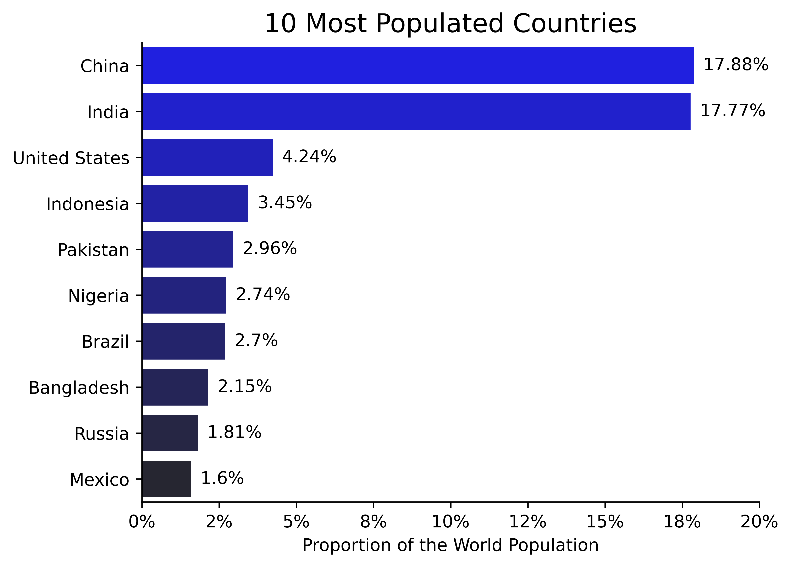
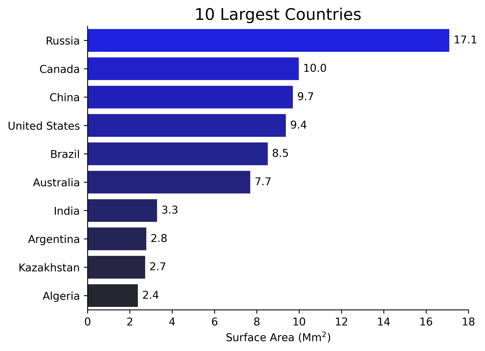
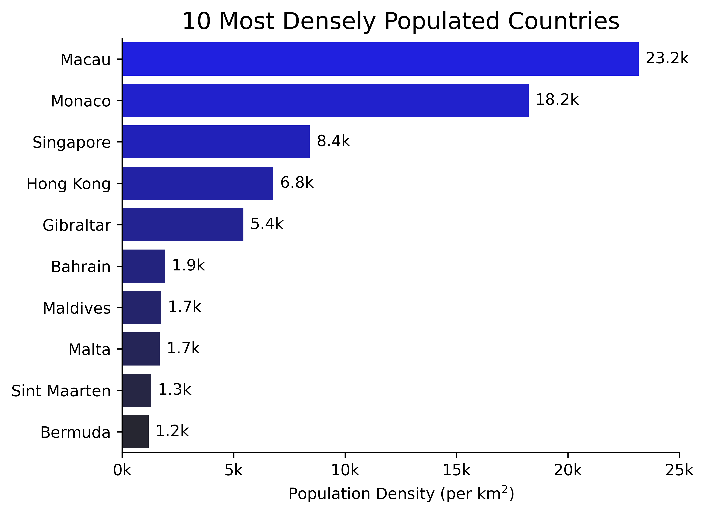
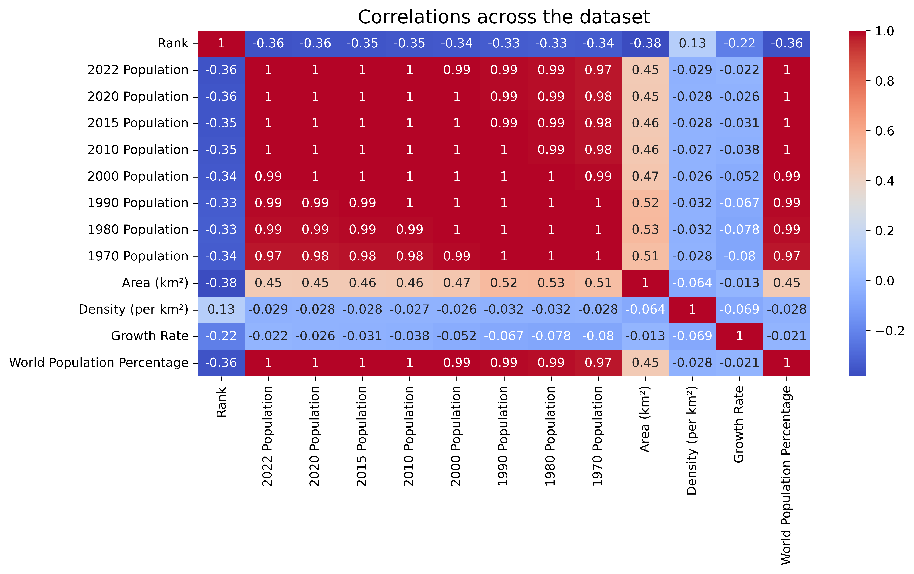
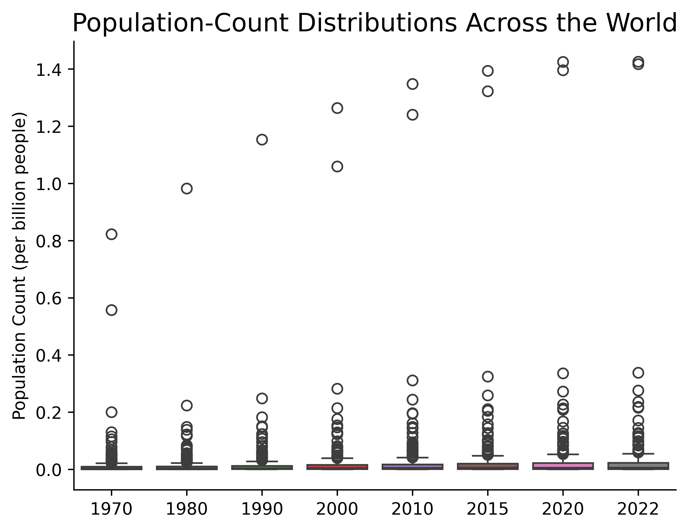
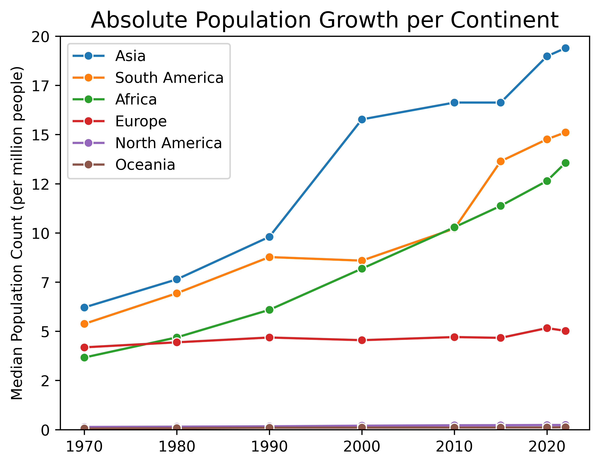
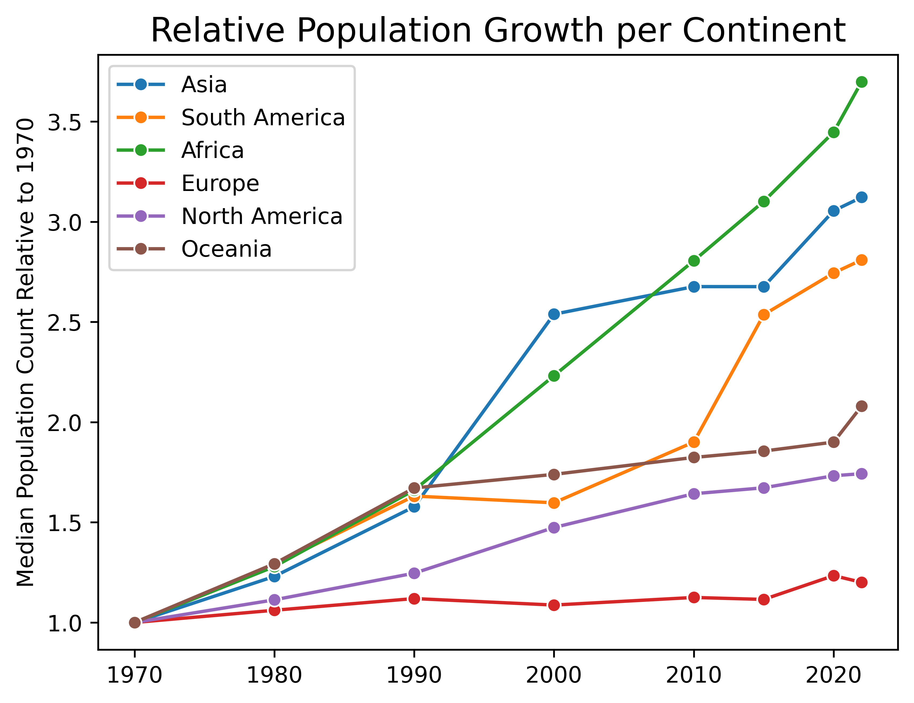

# Python project - World population analysis

## Introduction
This project aims at extracting insights from a dataset of per-country population counts (from 1970 to 2022).

The dataset was obtained [here](https://github.com/AlexTheAnalyst/PandasYouTubeSeries/blob/main/world_population.csv) from Alex Freberg's Github repository.

## Answered questions

1. What are the most populated countries?
2. What are the largest countries?
3. What are the most densely populated countries?
4. Are there correlations between the above features? 
5. How are world-wide population counts distributed?
6. Have certain continental populations grown faster than others?

## Tools I used
This project was carried out using the following tools:
- **Python (Pandas, Matplotlib, Seaborn)** - backbone of the data analysis and visualization.
- **Jupyter Notebooks** - facilitating table and plot visualizations during the analysis.
- **Visual Studio Code** - my go-to code editor.
- **Git/Github** - essential for version control and code sharing.

## Analysis

The data analysis and visualization were performed in the Jupyter Notebook [world_population.ipynb](world_population.ipynb) based on the dataset contained in [world_population.csv](world_population.csv).

```python
import pandas as pd

df = pd.read_csv('world_population.csv')
```

### What are the most populated countries?

```python
n_countries = 10
column = 'World Population Percentage'

# Select and sort data
df_plot = df.sort_values(column, ascending=False).head(n_countries).copy()
```



- China and India are far ahead of other countries, accounting for 17.88% and 17.77% of the world population, respectively.
- The United States comes third, accounting for 4.24% of the world population.


### What are the largest countries?

```python
# Get area column name
columns = df.columns.to_list()
column = [x for x in columns if x.startswith('Area')][0]

# Select and sort data
df_plot = df.sort_values(column, ascending=False).head(n_countries).copy()
```



- Russia is the largest country with a surface area of 17.1 Mm<sup>2</sup>.
- It is followed by a cluster of countries consisting of Canada, China, the United States, Brazil and Australia, whose surface areas range from 7.7 Mm<sup>2</sup> to 10 Mm<sup>2</sup>.
- Other countries have surface areas below (or equal to) 3.3 Mm<sup>2</sup>.


### What are the most densely populated countries?

```python
# Get density column name
columns = df.columns.to_list()
column = [x for x in columns if x.startswith('Density')][0]

# Select and sort data
df_plot = df.sort_values(column, ascending=False).head(n_countries).copy()
```



- Macau and Monaco are the most densely populated countries, with population densities (per km<sup>2</sup>) of 23.2k and 18.2k, respectively.
- They are followed by a cluster of countries consisting of Singapore, Hong Kong and Gibraltar, whose population densities (per km<sup>2</sup>) range from 5.4k to 8.4k.
- Other countries have population densities (per km<sup>2</sup>) below (or equal to) 1.9k.


### Are there correlations between the above features? 

Given the discrepancies between top-ranking countries in the above graphs, it makes sense to investigate correlations within the dataset. Thus, let us compute and visualize correlations within a heat map.

```python
correlations = df.corr(numeric_only=True)
```



- Yearly population counts and the world population percentage are heavily correlated.
- The country area is mildly correlated with yearly population counts and the world population percentage.
    - This makes sense as a large surface area is a necessary condition for very large populations with reasonable population densities.
- The population density is not correlated with yearly population counts and the world population percentage.
    - This makes sense as large countries can have large populations without the need for large population densities.


### How are world-wide population counts distributed?

```python
# Get population-count column names and associated years (all sorted)
columns = df.columns.to_list()
columns = [x for x in columns if x.endswith('Population')]
columns.sort()

years = [x[0:4] for x in columns]

# Select data and rename columns
df_plot = df[columns].copy()
df_plot = df_plot.rename(columns=dict(zip(columns, years)))
```



- Population counts are heavily skewed toward lower values, presenting a wide range of large-count outliers.
    - In particular, one can track the population counts of India and China as the two largest outliers every year (China's being larger than India's).
    - India lacks two data points, in 1980 and 1990, associated with NaN values in the dataset.
- Given this large skewness, it would be advisable to use medians rather than means as trend descriptors for population counts.


### Have certain continental populations grown faster than others?

We group data by continents, aggregating them using the median (more robust to data outliers than the mean). Data is then sorted by the 2022 population count (for convenience) and population counts are isolated.

```python
# Aggregate data by continent using the median
df_continent = df.groupby('Continent').median(numeric_only=True)

# Sort data according to the 2022 population (for convenience)
df_continent = df_continent.sort_values('2022 Population', ascending=False)

# Get population-count column names and associated years (all sorted)
columns = df_continent.columns.to_list()
columns = [x for x in columns if x.endswith('Population')]
columns.sort()

years = [x[0:4] for x in columns]

# Isolate population counts and rename columns
df_continent = df_continent[columns]
df_continent = df_continent.rename(columns=dict(zip(columns, years)))
```

#### Absolute population growth

```python
# Melt table so that years can be used as numbers instead of categories 
# (for plotting years to scale)
df_plot = df_continent.melt(var_name = 'year', value_name='median', ignore_index=False)
df_plot['year'] = df_plot['year'].apply(lambda x: int(x))
```



- The Asian, South American and African populations seem to have shown significant absolute growth compared to the European one.
- North America and Oceania seem to have had insignificant growth on this graph. 
- However, given that the North American and Oceanian populations are not of the same order of magnitude compared to the other populations, it may be insightful to also look at relative population changes.


#### Relative population growth

Let us normalize the median population counts using the 1970 ones to evaluate the relative population changes since 1970.

```python
df_continent_2 = df_continent.copy()

# Normalize population counts relative to the 1970 ones
reference_year = '1970'
reference = df_continent_2[reference_year]
for x in df_continent_2.columns:
    df_continent_2[x] = df_continent_2[x]/reference

# Melt table so that years can be used as numbers instead of categories 
# (for plotting years to scale)
df_plot_2 = df_continent_2.melt(var_name = 'year', value_name='median', ignore_index=False)
df_plot_2['year'] = df_plot_2['year'].apply(lambda x: int(x))
```



- Asia, South America and Africa feature the largest relative population growths.
- While Asia previously showed the largest absolute population count in 2022, Africa now presents the largest relative population growth over the 1970-2022 period.
- North America and Oceania have similar relative population growths.
- Europe shows very little relative population growth compared to other continents.